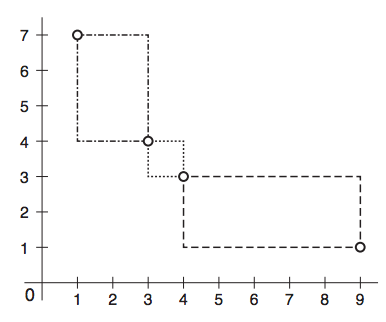

## 문제

Retangolândia é uma cidade muito antiga e, por isso, guarda diversas riquezas históricas. A cidade foi planejada muitas décadas atrás, com todas as suas ruas indo nas direções norte-sul ou leste-oeste. Atualmente, há um projeto de revitalização da cidade, no qual uma nova praça retangular será feita. A escolha da nova praça será feita pela administração pública mas, no momento, eles estão interessados em quais seriam as posições possíveis para esta praça, levando-se em consideração que a praça deve estar alinhada com as ruas e, assim, quando visualizada em um mapa, seus lados devem ser segmentos horizontais e verticais. Com o objetivo de conciliar as riquezas históricas com as novas iniciativas, alguns cuidados devem ser tomados.

Existem postes de iluminação, do século XIX, espalhados pela cidade. Por seu valor histórico, nenhum poste pode ser derrubado. Por conta do desgaste natural e da falta de manutenção, nenhuma rua possui mais do que um poste restante. Para o posicionamento da praça, entretanto, não se deseja que um destes postes esteja no interior da mesma. Por outro lado, o projeto paisagístico da nova praça prevê que dois dos postes históricos estejam em duas das esquinas. A figura abaixo mostra um exemplo com quatro postes e as três localizações possíveis para a praça.

A prefeitura contratou uma empresa de georeferenciamento para efetuar um levantamento das posições dos postes. Com esses dados em mãos, o próximo passo é determinar quantas são as localizações possíveis para a praça, para que se possa dimensionar o tamanho da equipe necessária para avaliar cada uma das localizações.

## 입력

A primeira linha da entrada contém um número inteiro N, 1 ≤ N ≤ 3000, representanto o número de postes. As N linhas seguintes descreverão, cada uma, a posição de um poste. A posição de um poste será dada por um par de números inteiros, X e Y, −108 ≤ X, Y ≤ 108 , correspondendo às suas coordenadas no plano.

## 출력

Seu programa deve produzir uma única linha contendo o número de diferentes localizações possíveis para a praça.
