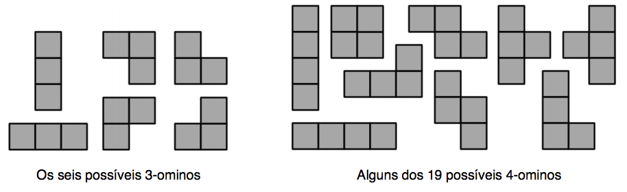

## 문제

O planeta de Skyrk nunca vai conhecer a paz enquanto o malvado Mago estiver livre. Dessa vez, o malicioso plano do Mago foi armar uma bomba no meio da maior cidade do planeta. Mago aprecia observar o caos, então, ao invés de explodir a bomba imediatamente, ele colocou um temporizador na bomba e a deixou junto com um desafio. A bomba tem um teclado, e a solução do desafio desarma a bomba.

O desafio se chama Omnibox; ele consiste de uma caixa retangular com alguns cubos unitários dentro e de uma coleção de todos os possíveis N-ominos. Skyrk deve soltar todo omino em algum lugar da caixa para ganhar pontos. A pontuação máxima é a solução do Ominobox.

Um N-omino é uma coleção de N quadrados unitários arranjados com lados coincidentes. Um 1-omino é um quadrado unitário, e um N-omino é um (N − 1)-omino com pelo menos um dos seus lados ligados a um quadrado unitário.

A caixa tem uma superfície retangular e paredes verticais; cada um dos quadrados de um sistema Cartesiano de coordenadas em grade colocado na superfície da caixa possui uma pilha não negativa de cubos unitários. Os cubos não podem ser movidos.

Skyrk irá alinhar cada omino com os quadrados da grade, e soltá-lo na caixa. O omino irá cair até tocar um cubo ou o fundo. Não é permitido que Skyrk reflita ou rotacione o omino, e ele deve situar-se completamente dentro dos limites da caixa. O número de pontos obtidos após soltá-lo é a distância entre o omino e o topo da caixa. Após soltá-lo, Skyrk anota o número de pontos, remove o omino, e solta o próximo. A pontuação final é a soma de todos os pontos.

O tempo está passando e a contagem regressiva na bomba diz 5:00 (cinco horas!). Você consegue descobrir a pontuação máxima que Skyrk pode obter para desarmar a bomba e salvar o destino do planeta das mãos do vil Mago?

## 입력

A primeira linha contém T (T ≤ 200) — o número de desafios, após essa linha haverá T desafios. Cada desafio começa com uma linha com quatro inteiros R, C, H e N (1 ≤ R, C, H ≤ 30; 1 ≤ N ≤ 10) — as dimensões da superfície da caixa são R × C, a altura é H, e a ordem dos ominos é N. Cada uma das próximas R linhas contém C inteiros Hij (0 ≤ Hij ≤ H) — o número de cubos no quadrado (i, j) da grade.

## 출력

Para cada desafio, imprima uma linha contendo X, onde X é a solução do Ominobox.
