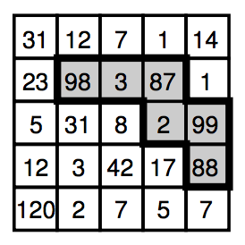

## 문제

O reino da Poliminogônia passou recentemente uma lei ecológica que obriga todas as fazendas a preservar o máximo de árvores possível em uma porcentagem fixa da área da fazenda. Além disso, para que os animais silvestres possam se movimentar livremente, a área preservada deve ser conexa.

As fazendas na Poliminogônia são sempre um reticulado de N × N quadrados de um hectare cada. A figura ao lado ilustra uma fazenda com N = 5. A área preservada deve cobrir exatamente M quadrados. No exemplo da figura, M = 6. Ela deve ser conexa ortogonalmente; quer dizer, tem que ser possível se movimentar entre quaisquer dois quadrados preservados apenas com movimentos ortogonais entre quadrados preservados. A área não preservada, entretanto, pode ser desconexa.

Os fazendeiros sabem o número de árvores que há dentro de cada quadrado e você deve escrever um programa que calcule o número máximo possível de árvores que podem ser preservadas com uma area de M quadrados. No exemplo, é possível preservar 377 árvores!

## 입력

A primeira linha da entrada contém dois inteiros N e M (2 ≤ N ≤ 50, 1 ≤ M ≤ 10). As N linhas seguintes contêm, cada uma, N inteiros de valor entre 1 e 1000, representando o número de árvores dentro de cada quadrado da fazenda.

## 출력

Seu programa deve imprimir uma linha contendo um número inteiro, o número máximo de árvores que podem ser preservadas, com as restrições dadas.
