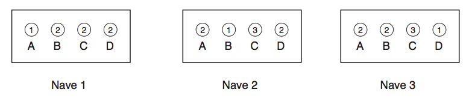

## 문제

A Confederação Galática instalou um novo sistema de teletransporte em suas naves espaciais. Cada nave recebeu uma cabine de teletransporte, na qual há um painel com quatro botões. Cada botão é rotulado com uma letra diferente A, B, C ou D e com um número que indica a nave destino para a qual o usuário será transportado, instantaneamente, se o respectivo botão for pressionado (como todos sabem, as naves da Confederação são identificadas por inteiros de 1 a N ).

Para usar o sistema, o usuário deve adquirir um bilhete para cada viagem que deseja realizar (uma viagem corresponde a pressionar um botão). Note que como o número botões no painel é pequeno comparado com o número de naves da Confederação, pode ser necessário que o usuário tenha que comprar um bilhete múltiplo de L viagens para ir de uma dada nave S para uma outra nave T.

Por exemplo, para as naves da figura abaixo, se o usuário está na cabine de teletransporte da nave 3 e pressiona o botão B ele é transportado para a nave 2. Se ele tem um bilhete múltiplo e pressiona novamente o botão B ele é então transportado para a nave 1.

Sua tarefa neste problema é, dados a nave de partida S, a nave de chegada T e o número de viagens L do bilhete, determinar quantas sequências distintas de L botôes levam o usuário da nave S para a nave T . Por exemplo, para as naves da figura acima, existem quatro sequências distintas de L = 2 botôes que levam um usuário da nave S = 3 para a nave T = 1: CD, DA, AB, e BB.

## 입력

A primeira linha da entrada contém dois inteiros N (1 ≤ N ≤ 100) e L (0 ≤ L < 230), indicando respectivamente o número de naves e o número de viagens do bilhete. A segunda linha da entrada contém dois inteiros S e T (1 ≤ S, T ≤ N ), indicando respectivamente a nave de partida e a nave de chegada. Cada uma das N linhas seguintes descreve o painel da cabine de teletransporte de uma nave. A i-ésima dessas linhas, 1 ≤ i ≤ N , contém quatro inteiros A, B, C e D (1 ≤ A, B, C, D ≤ N ), que representam os números escritos nos quatro bot ̃oes da cabine de teletransporte da nave de número i.

## 출력

Seu programa deve produzir uma única linha, contendo um único inteiro, que deve ser igual a r módulo 104 , onde r é o número de sequências distintas de L botões que levam o usuário da nave S para a nave T.
