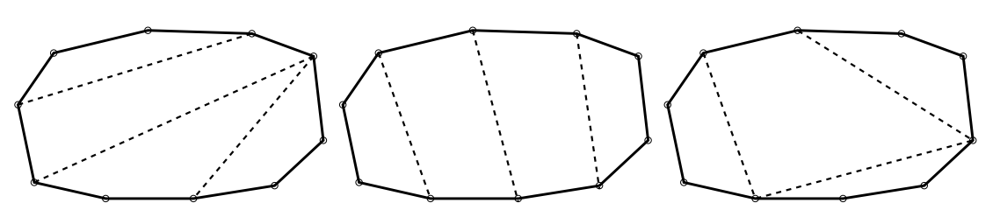

## 문제

Todo polígono convexo, com 2N vértices, pode ser decomposto em N − 1 quadril ́ateros, fazendo-se N − 2 cortes em linha reta entre certos pares de vértices. A figura abaixo ilustra três diferentes decomposiçõoes do mesmo polígono com N = 5. O peso da decomposição é a soma dos comprimentos de seus N − 2 cortes. Seu programa deve computar o peso de uma decomposição de peso mínimo!

## 입력

A primeira linha da entrada contém um inteiro N (2 ≤ N ≤ 100). As 2N linhas seguintes contém cada uma dois números reais X e Y (0 ≤ X, Y ≤ 10000), com precisão de 4 casas decimais: as coordenadas dos 2N pontos, em sentido anti-horário, do polígono convexo.

## 출력

Seu programa deve imprimir uma linha contendo um número real, com precisão de 4 casas decimais. O número deve ser o peso de uma decomposição de peso mínimo do polígono dado.
