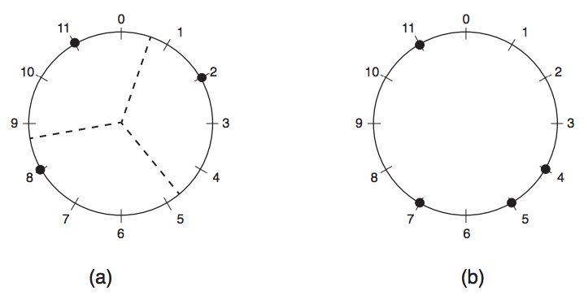

## 문제

Vovô Pepe é famoso por suas pizzas. Elas são deliciosas, e têm o formato de um círculo perfeito. Vovô preparou uma pizza especial para o jantar de hoje à noite, e colocou um certo número de azeitonas distribuídas aleatoriamente, mas colocadas exatamente na borda da pizza.

Sua tarefa é determinar, conhecendo a circunferência da pizza, a quantidade de azeitonas e a posição de cada azeitona, se é possível dividir a pizza em setores circulares de mesmo tamanho, de tal forma que cada pedaço de pizza contenha exatamente uma azeitona.

A figura abaixo mostra (a) uma pizza de circunferência 12 com 3 azeitonas e uma possível divisão em pedaços iguais; e (b) uma pizza de circunferência 12 com 4 azeitonas que não pode ser dividida em pedaços iguais como descrito acima. Apesar de deliciosas, as azeitonas são muito pequenas, e suas dimensões podem ser desconsideradas no cálculo da divisão.

## 입력

A primeira linha contém dois inteiros C (3 ≤ C ≤ 105 ) e N (3 ≤ N ≤ 104 , N ≤ C) representando respectivamente a circunferência da pizza e o número de azeitonas. O inteiro C é múltiplo de N. A segunda linha contém N inteiros distintos Xi (0 ≤ X1 < X2 < . . . < XN < C), em ordem crescente, descrevendo as posições das azeitonas, dadas pelo comprimento do arco circular no sentido horário, a partir de um ponto fixo da circunferência.

## 출력

Seu programa deve produzir apenas uma linha, com apenas uma letra, que deve ser S se é possível dividir a pizza como descrito acima, ou N caso contrário.
