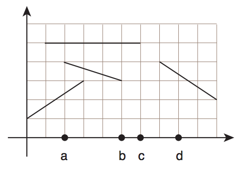

## 문제

One of the main difficulties of organizing a Programming Contest is collecting the balloons that escape and are trapped on the roof of the competition hall: often the contract with the hall owner requires that the hall must be cleaned soon after the event, otherwise a fine is applied.

This year the organization of our competition have been more prudent: it got the project design of the ceiling of the hall, and wants your help to determine what will happen to a loose balloon depending on the position on the ground where it is released (that is, whether it is blocked by the ceiling or escapes to the outside of the hall).

The ceiling of the hall consists of several plans that, viewed from the side, can be described by line segments, as shown in the figure below:

The balloon may be considered to be a point. When a balloon touches a line segment that is horizontal, it gets stuck. When a balloon touches a segment that is tilted, the balloon glides to the highest point of the segment and escapes. It may then escape from the hall or it may touch more segments. There are no points in common between the line segments that form the ceiling.

For example, if a balloon is released at the positions marked as a or b, it will be stuck in the position with coordinates (2, 5); if a balloon is released at the position marked c, it will be stuck in the position of coordinates (6, 5); and if the balloon is released at the position marked as d, it will not be blocked and will escape out of the hall in the position of coordinate x = 7.

Write a program that, given the description of the ceiling of the hall as line segments, answers a series of queries about the final positions of balloons released at the hall floor.

## 입력

The first line of input contains two integers N and C indicating, respectively, the number of segments describing the ceiling, and the number of queries. Each of the next N lines contains four integers X1, Y1, X2, Y2, describing a line segment from the ceiling, with end points at coordinates (X1, Y1) and (X2, Y2).

Each of the next C describe a query and contains an integer X, indicating that the query wants to determine what happens to a balloon releaset at the point of coordinates (X, 0).

Restrictions

* 1 ≤ N ≤ 105
* 1 ≤ C ≤ 105
* 0 ≤ X1, X2 ≤ 106, 0 < Y1, Y2 ≤ 106, X1 ≠ X2
* no two x coordinate values are equal, considering all segments.
* 0 ≤ X ≤ 106

## 출력

For each query in the input your program must output a single line. If the balloon escapes the hall, the line must contain a single integer X, indicating the x coordinate where eht balloon escapes the hall. Otherwise, the line must contain two integers X and Y indicating the position (x, y) where the balloon gets stuck in the ceiling.
