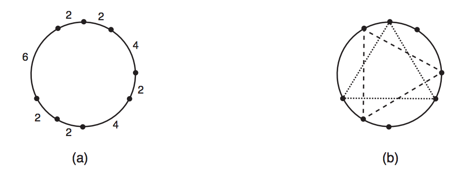

## 문제

You will be given N points on a circle. You must write a program to determine how many distinct equilateral triangles can be constructed using the given points as vertices.

The figure below illustrates an example: (a) shows a set of points, determined by the lengths of the circular arcs that have adjacent points as extremes; and (b) shows the two triangles which can be built with these points.

## 입력

The first line of the input contains an integer N, the number of points given. The second line contains N integers Xi, representing the lengths of the circular arcs between two consecutive points in the circle: for 1 ≤ i ≤ (N − 1), Xi represents the length of the arc between between points i and i + 1; XN represents the length of the arc between points N and 1.

Restrictions

* 3 ≤ N ≤ 105
* 1 ≤ Xi ≤ 103, for 1 ≤ i ≤ N

## 출력

Your program must output a single line, containing a single integer, the number of distinct equilateral triangles that can be constructed using the given points as vertices.
