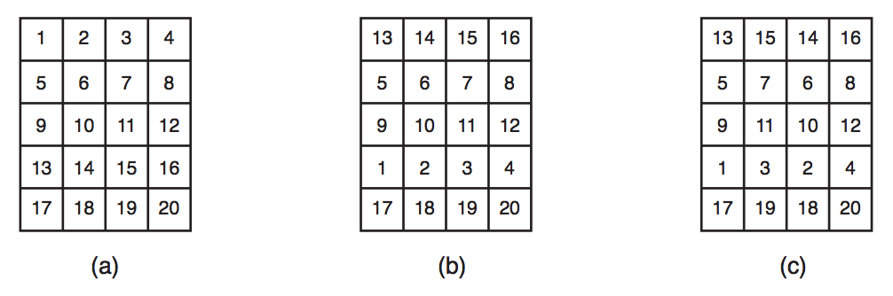

## 문제

A shipment of Nlogs, the main export product from Nlogonia, is in the harbour, in containers, ready to be shipped. All containers have the same dimensions and all of them are cubes. Containers are organized in the cargo terminal in L lines and C columns, for a total of LC containers. Each container is marked with a distinct identification number, from 1 to LC.

Each one of the L container lines will be loaded in a different ship. To make it simpler when unloading at each destination country, containers from a line must be organized such that the identifiers are in sequential order. More precisely, the first line must have the containers identified from 1 to C in increasing order, line 2 must have containers numbered from C + 1 to 2C (in increasing order), and so on until the last line. which will have containers numbered (L−1)C + 1 to LC (again, in increasing order). Figure (a) shows the organization of a shipment with 5 lines and 4 columns of containers.

A crane is able to move either a full line or a full column of containers. It cannot move other groupments or individual containers.

In night before the loading, a group of workers operated the cranes to swap shipment lines and columns as a way of protest because of low salaries. Figure (b) shows the configuration after swapping lines 1 and 4; Figure (c) shows the configuration after another swap, this time between colummns 2 and 3.

The loading must be done today, but before starting the containers must be reorganized as described previously. You must write a program which, given the information about the position of every container after the protest, determines whether you can reposition the containers in such way that every one of them is in its expected positions, using only cranes. If repositioning is possible, you must also calculate the smallest number of column and line swaps needed to do it.

## 입력

The first line of input contains two integers L and C which describe, respectively, the number of lines and columns of the shipment. The next L lines show the configuration of the containers after the workers protest. Each of these L lines will have C integers Xl,c, indicating the position of a container. Every integer between 1 and LC appears exactly once in the input.

Restrictions

* 1 ≤ L ≤ 300
* 1 ≤ C ≤ 300
* 1 ≤ Xl,c ≤ LC

## 출력

Your program must produce a single line, containing a single integer, the minimum number of column and line swaps needed to place the containers in their original positions. If there is no way to place the containers in their original positions using only cranes, the line must contain only the character ‘\*’.
