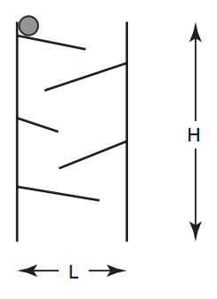
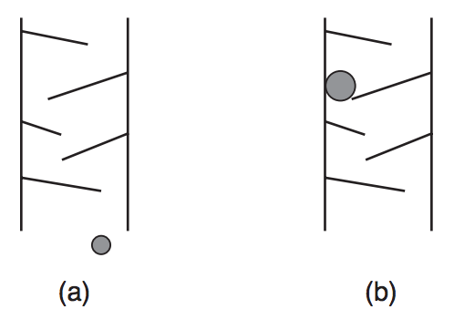

## 문제

Uma fábrica quer produzir um tobogan de brinquedo como o da figura abaixo, composto de duas hastes de madeira sustentando aletas que se alternam nas duas hastes. Uma bolinha de aço é solta na aleta mais alta do tobogan; sob efeito da gravidade, a bolinha desliza pelas aletas, terminando por sair do brinquedo.

O projeto do brinquedo, contendo as especificações do tamanho, posição e inclinação das hastes e de cada aleta, foi feito pelo dono da fábrica, e milhares de unidades já estão sendo confeccionadas na China. O gerente da fábrica foi incumbido de comprar as bolinhas de aço, mas antes de fazer o pedido das milhares de bolinhas quer saber o diâmetro máximo da bolinha, para que esta não pare no meio do brinquedo.

  
Figura 1: Dois exemplos: em (a) a bolinha chega ao final, e (b) a bolinha para no meio do brinquedo e não chega ao final.

O gerente da fábrica quer que você escreva um programa que, dadas as especificações do brinquedo, determine o diâmetro máximo da bolinha para que esta não pare no meio do brinquedo.

## 입력

A primeira linha de um caso de teste contém um inteiro N indicando o número de aletas do brinquedo. A segunda linha contém dois inteiros L e H, indicando respectivamente a distância entre as hastes e a altura das hastes do brinquedo. A haste esquerda do brinquedo está na posição 0 do eixo de coordenadas X, de forma que a haste direita está na posição L do eixo X.

Cada uma das N linhas seguintes descreve uma aleta. As aletas são descritas da mais alta para a mais baixa, de forma alternada em relação à haste na qual a aleta está conectada. A aleta mais alta do brinquedo (a primeira a ser descrita) tem a extremidade ligada à haste esquerda; a segunda aleta mais alta (a segunda a ser descrita) tem a extremidade ligada à haste direita, assim alternadamente. As aletas ímpares têm a extremidade ligada à haste esquerda, as aletas pares têm a extremidade ligada à haste direita.

Cada aleta é descrita em uma linha contendo três números inteiros Yi, Xf e Yf , separados por um espaço em branco. (Xf , Yf ) indica a coordenada do final da aleta; para aletas ímpares a coordenada do início da aleta é (0, Yi), e para aletas pares a coordenada do início da aleta é (L, Yi).

Para todas as aletas Yi > Yf (ou seja, há um declive entre o início e o final da aleta), e o comprimento da aleta é menor do que a largura do brinquedo. Além disso, para duas aletas consecutivas A e B, YfA >= YiB (ou seja, o final da aleta A tem altura maior do que ou igual ao início da aleta B).

Considere que as aletas são muito finas, de forma que a sua espessura pode ser desconsiderada, e que a sua largura é sempre maior do que o diâmetro da bolinha (ou seja, a bolinha sempre tem espaço lateral para deslizar pela aleta).

Restrições

* 1 ≤ N ≤ 103
* 1 ≤ L ≤ 103
* 1 ≤ H ≤ 103
* 0 < Xf < L
* 0 ≤ Yi ≤ H, 0 ≤ Yf ≤ H e Yi > Yf

## 출력

Para cada caso de teste imprima uma linha contendo um único número, com exatamente duas casas decimais, indicando o maior diâmetro de bolinha tal que esta consiga percorrer todo o brinquedo.
