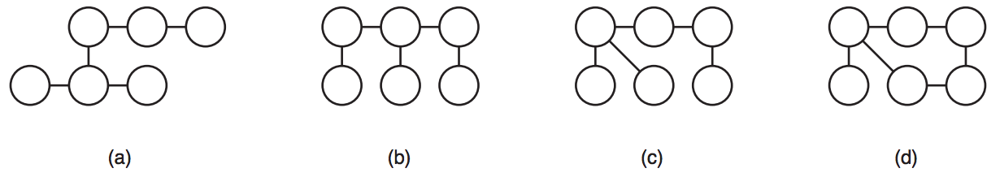

## 문제

Pesquisadores da Fundação Contra o Câncer (FCC) anunciaram uma descoberta revolucionária na Química: eles descobriram como fazer átomos de carbono ligarem-se a qualquer quantidade de outros átomos de carbono, possibilitando a criação de moléculas muito mais complexas do que as formadas pelo carbono tetravalente. Segundo a FCC, isso permitirá o desenvolvimento de novas drogas que poderão ser cruciais no combate ao câncer.

Atualmente, a FCC só consegue sintetizar moléculas com ligações simples entre os átomos de carbono e que não contêm ciclos em suas estruturas: por exemplo, a FCC consegue sintetizar as moléculas (a), (b) e (c) abaixo, mas não a molécula (d).

Devido à agitação térmica, uma mesma molécula pode assumir vários formatos. Duas moléculas são equivalentes se for possível mover os átomos de uma das moléculas, sem romper nenhuma das ligações existentes nem criar novas ligações químicas, de forma que ela fique exatamente igual à outra molécula. Por exemplo, na figura acima, a molécula (a) não é equivalente à molécula (b), mas é equivalente à molécula (c).

Você deve escrever um programa que, dadas as estruturas de duas moléculas, determina se elas são equivalentes.

## 입력

A primeira linha de um caso de teste contém um inteiro N indicando o número de átomos nas duas moléculas. Os átomos são identificados por números inteiros de 1 a N. Cada uma das 2N − 2 linhas seguintes descreve uma ligação química entre dois átomos: as primeiras N − 1 linhas descrevem as ligações da primeira molécula; as N − 1 últimas descrevem as ligações químicas da segunda molécula. Cada linha contém dois inteiros A e B indicando que existe uma ligação química entre os átomos A e B.

Restrições

* 2 ≤ N ≤ 104
* 1 ≤ A, B ≤ N

## 출력

Para cada caso de teste seu programa deve imprimir uma única linha, contendo um único caractere: S se as moléculas são equivalentes ou N caso contrário.
