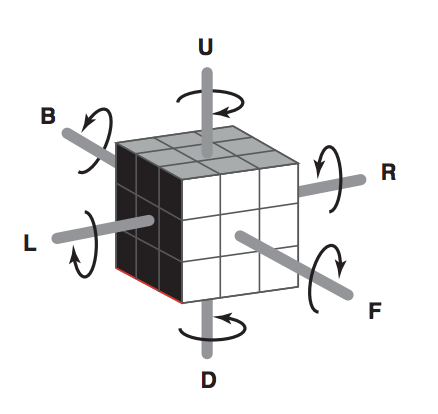

## 문제

Provavelmente todos conhecem o Cubo de Rubik, um passatempo 3-D desafiador, que tem cada uma das seis faces cobertas com nove etiquetas, cada etiqueta de uma cor (azul, amarelo, laranja, branco, verde e vermelho). No estado inicial, todas as nove etiquetas de uma face têm a mesma cor. Um mecanismo engenhoso permite que cada face seja rotacionada independentemente, fazendo com que as cores das etiquetas nas faces possam ser misturadas.

Cada uma das faces do Cubo de Rubik é denotada por uma letra: F, B, U, D, L, e R, como ilustrado na figura abaixo.

A rotação de uma face é denominada de um movimento. Para descrever os movimentos utilizamos as letras identificadoras das faces:

* uma letra maiúscula representa um giro de 90o no sentido horário da face correspondente;
* uma letra minúscula representa um giro de 90o no sentido anti-horário da face correspondente.

Por exemplo, F representa um giro de 90o no sentido horário da face F; r representa um giro de 90o no sentido anti-horário da face R. Uma sequência de movimentos é denotada por uma sequência de letras identificadoras de faces. Assim, rDF representa um giro de 90o no sentido anti-horário da face R, seguido de um giro de 90o no sentido horário da face D, seguido de um giro de 90o no sentido horário da face F.

Uma propriedade interessante do Cubo de Rubik é que qualquer sequência de movimentos, se aplicada repetidas vezes, faz com que o cubo retorne ao estado original (estado que tinha antes da primeira aplicação da sequência). Por exemplo, após quatro aplicações da sequência B o cubo retorna ao estado original.

Você deve escrever um programa que, dada uma sequência de movimentos, determine o menor número de aplicações completas dessa sequência para que o cubo retorne ao seu estado original.

## 입력

Cada caso de teste é descrito em uma única linha, que contém a sequência de movimentos.

Restrições

* Cada sequência tem no mínimo um movimento e no máximo 80 movimentos.

## 출력

Para cada caso de teste seu programa deve imprimir uma única linha, contendo um único inteiro, indicando o menor número de aplicações completas da sequência para que o cubo retorne ao seu estado original.
