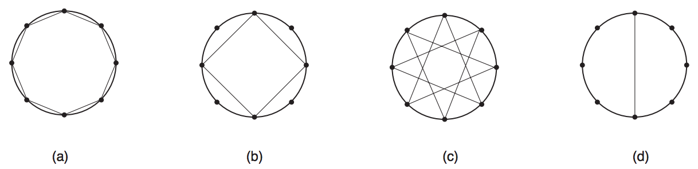

## 문제

Fernando ganhou um compasso de aniversário, e agora sua diversão favorita é desenhar estrelas: primeiro, ele marca N pontos sobre a circunferência, dividindo-a em N arcos iguais; depois, ele liga cada ponto ao k-ésimo ponto seguinte, até voltar ao ponto inicial.

Dependendo do valor de k, Fernando pode ou não atingir todos os pontos marcados sobre a circunferência; quando isto acontece, a estrela é chamada de completa. Por exemplo, quando N = 8, as possíveis estrelas são as mostradas no desenho abaixo; as estrelas (a) e (c) são completas, enquanto as estrelas (b) e (d) não o são.

Dependendo do valor de N, pode ser possível desenhar muitas estrelas diferentes; Fernando pediu que você escrevesse um programa que, dado N, determina o número de estrelas completas que ele pode desenhar.

## 입력

Cada caso de teste contém de uma única linha, contendo um único inteiro N, indicando o número de arcos no qual a circunferência foi dividida.

Restrições

* 3 ≤ N < 231

## 출력

Para cada caso de teste, seu programa deve imprimir uma única linha contendo um único inteiro, indicando o número de estrelas completas que podem ser desenhadas.
