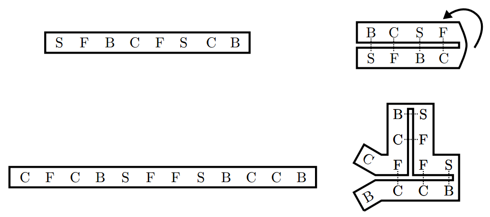

## 문제

Foi descoberta uma espécie alienígena de ácido ribonucleico (popularmente conhecido como RNA). Os cientistas, por falta de criatividade, batizaram a descoberta de ácido ribonucleico alienígena (RNAA). Similar ao RNA que conhecemos, o RNAA é uma fita composta de várias bases. As bases são B C F S e podem ligar-se em pares. Os únicos pares possíveis são entre as bases B e S e as bases C e F.

Enquanto está ativo, o RNAA dobra vários intervalos da fita sobre si mesma, realizando ligações entre suas bases. Os cientistas perceberam que:

* Quando um intervalo da fita de RNAA se dobra, todas as bases neste intervalo se ligam com suas bases correspondentes;
* Cada base pode se ligar a apenas uma outra base;
* As dobras ocorrem de forma a maximizar o número de ligações feitas sobre fitas;

As figuras abaixo ilustram dobras e ligacões feitas sobre fitas.

Sua tarefa será, dada a descrição de uma tira de RNAA, determinar quantas ligações serão realizadas entre suas bases se a tira ficar ativa.

## 입력

A entrada é composta por diversos casos de teste e termina com EOF. Cada caso de teste possui uma linha descrevendo a sequência de bases da fita de RNAA. Uma fita de RNAA na entrada contém pelo menos 1 e no máximo 300 bases. Não existem espaços entre bases de uma fita da entrada. As bases são 'B', 'C', 'F' e 'S'.

## 출력

Para cada instância imprima uma linha contendo o número total de ligações que ocorre quando a fita descrita é ativada.
