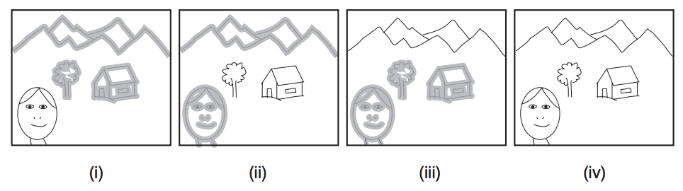

## 문제

Daniel esta fazendo um curso de Visão Computacional e decidiu reproduzir um trabalho muito interessante visto em aula: ele tirou varias fotos de uma mesma cena, variando apenas o foco, para depois combina-las em uma unica imagem onde todos os objetos da cena estão nítidos simultaneamente. Para tal, ele precisa que cada objeto apareca nítido em ao menos uma foto.

Daniel sabe que, para cada objeto, existe um intervalo fechado de planos de foco no qual aquele objeto está contido. Por exemplo, na figura abaixo, (i), (ii) e (iii) são três fotos da mesma cena, cada uma tirada com um foco diferente; (iv) é a imagem combinada gerada por Daniel.

Como o cartão de memoria de sua câmera é pequeno, ele pediu sua ajuda para, dados os intervalos de foco de todos os objetos da cena que pretende fotografar, determinar o numero mínimo de fotos que ele deve tirar para que seja possível deixar cada objeto nítido em pelo menos uma foto.

## 입력

A entrada é composta por diversos casos de teste. A primeira linha de cada caso de teste contém um inteiro N (1 ≤ N ≤ 106) indicando o número de objetos na cena. Cada uma das N linhas seguintes contém dois inteiros A e B (1 ≤ A ≤ B ≤ 109) indicando os extremos do intervalo de foco de cada objeto.

## 출력

Para cada caso de teste, imprima uma linha contendo um inteiro indicando o menor número de fotos que Daniel deve tirar.
