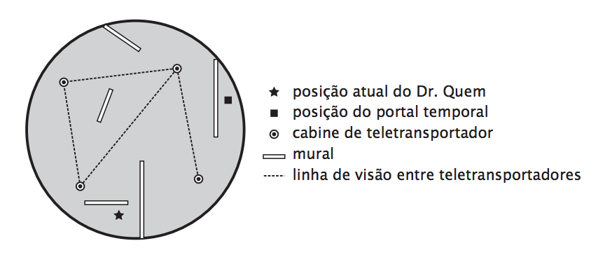

## 문제

No ano de 2222 B.C.E., uma terrível tragédia ocorreu na ilha de Atlântida, mas até hoje só se sabe do ocorrido pelos relatos históricos; ninguém nunca encontrou evidência física do incidente. Para remediar essa situação, o Doutor Quem resolveu usar a sua máquina do tempo para voltar a Atlântida logo antes do desastre.

Precavido, assim que chegou a Atlântida o Doutor quem instalou um portal temporal, que o trará imediatamente ao tempo atual. Ele iniciou então sua exploração, e o que descobriu foi surpreendente: Atlântida é uma ilha circular, sobre a qual foi fundada uma civilização extremamente avançada; prova disso são as várias cabines da rede de teletransportadores que foi construída na ilha. As cabines operam através de raios de luz e portanto só é possível teletransportar se existir uma linha de visão desobstruída entre a cabine de origem e a cabine de destino. Não por acaso, elas são algumas das construções mais imponentes da ilha, com dezenas de metros de altura, mais baixas apenas do que os gigantes murais que descrevem a história de Atlântida desde a sua fundação. Os murais são enormes muros de concreto, que dificultam a exploração do Doutor Quem pois não podem ser transpostos, obrigando o famoso cientista a contorná-los para prosseguir em seu caminho.

Ao explorar a ilha, o Doutor Quem se mostrou surpreso em encontrá-la deserta. Depois de muito refletir, tornou-se obvio o porquê: ele programou mal sua máquina do tempo, e chegou imediatamente antes do maremoto que destruiu Atlântida (os geólogos atlântidos já haviam previsto o maremoto e ordenado a evacuação imediata da ilha). Tomando ciência desse fato, o Doutor Quem imediatamente tratou de planejar a sua fuga

Para voltar ao portal temporal, ele pretende utilizar os teletransportadores, mas ele descobriu que, devido ao maremoto, o sistema de energia só tem capacidade para um número limitado de teletransportes. Ele quer saber a menor distância que ele precisa andar até chegar no portal temporal, e por isso precisa da sua ajuda.

## 입력

A entrada é composta por diversos casos de teste. A primeira linha de cada caso de teste contém três inteiros T, M e C, indicando respectivamente a quantidade de vezes que a rede de teletransporte ainda pode ser usada, o número de murais em Atlântida e o número de cabines de teletransporte.

As M linhas seguintes descrevem os murais, que são todos retilíneos: cada linha contém quatro inteiros X1 , Y1 , X2 e Y2 indicando as coordenadas das extremidades de cada mural. Os murais têm espessura desprezível, e nenhum par de murais se intersecta, nem mesmo nas extremidades.

As C linhas seguintes descrevem a posição das cabines: cada linha contém dois inteiros XC e YC indicando a posição de uma cabine de teletransporte.

Finalmente, a última linha do caso de teste contém quatro inteiros XQ , YQ , XP e YP indicando as coordenadas da posição inicial do Doutor Quem e do portal, respectivamente.

Restrições

* 0 ≤ T, M, C ≤ 50
* As coordenadas de cada ponto na entrada têm valor absoluto menor ou igual a 2x104
* O centro da ilha é o ponto (0, 0) e seu raio é 105.
* As posições do Doutor Quem, do portal temporal e das cabines de teletransporte são todas distintas e não estão sobre murais.

## 출력

Para cada caso de teste na entrada o seu programa deve imprimir em uma unica linha, com uma casa decimal, a distância que o Doutor Quem precisa andar para chegar em seu portal, sem contar as distâncias percorridas nos teletransportadores.
