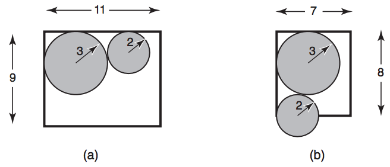

## 문제

A FCC (Fábrica de Cilindros de Carbono) fabrica vários tipos de cilindros de carbono. A FCC está instalada no décimo andar de um prédio, e utiliza os vários elevadores do prédio para transportar os cilindros. Por questão de segurança, os cilindros devem ser transportados na posição vertical; como são pesados, no máximo dois cilindros podem ser transportados em uma única viagem de elevador. Os elevadores têm formato de paralelepípedo e sempre têm altura maior que a altura dos cilindros.  
  
Para minimizar o número de viagens de elevador para transportar os cilindros, a FCC quer, sempre que possível, colocar dois cilindros no elevador. A figura abaixo ilustra, esquematicamente (vista superior), um caso em que isto é possível (a), e um caso em que isto não é possível (b):

Como existe uma quantidade muito grande de elevadores e de tipos de cilindros, a FCC quer que você escreva um programa que, dadas as dimensões do elevador e dos dois cilindros, determine se é possível colocar os dois cilindros no elevador.

## 입력

A entrada contém vários casos de teste. A primeira e única linha de cada caso de teste contém quatro números inteiros L, C, R1 e R2, separados por espaços em branco, indicando respectivamente a largura do elevador (1 ≤ L ≤ 100), o comprimento do elevador (1 ≤ C ≤ 100), e os raios dos cilindros (1 ≤ R1, R2 ≤ 100).

O último caso de teste é seguido por uma linha que contém quatro zeros separados por espaços em branco.

## 출력

Para cada caso de teste, o seu programa deve imprimir uma única linha com um único caractere: ‘S’ se for possível colocar os dois cilindros no elevador e ‘N’ caso contrário.
