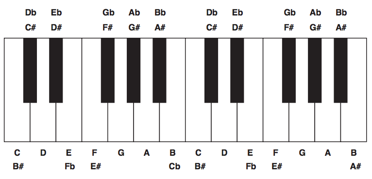

## 문제

As notas musicais são unidades básicas da música ocidental tradicional. Cada nota está associada a uma frequência. Duas notas musicais cujas frequêcias fundamentais tenham uma relação de potência de 2 (uma metade da outra, uma duas vezes a outra, etc.) são percebidas como muito similar. Por isso, todas as notas com esse tipo de relação recebem o mesmo nome, como descrito a seguir.  
  
Há doze notas básicas, em uma sequência crescente de frequências, cada nota separada da anterior por uma mesma distância na escala musical (essa distância é chamada de meio-tom). Sete dessas doze notas são representadas por letras do alfabeto (A, B, C, D, E, F e G). A tabela abaixo mostra a distância, em meio-tons, entre essas notas.

|  |  |  |  |  |  |  |  |
| --- | --- | --- | --- | --- | --- | --- | --- |
| Notas | A-B | B-C | C-D | D-E | E-F | F-G | G-A |
| Número de meios-tons | 2 | 1 | 2 | 2 | 1 | 2 | 2 |

Note que há cinco notas que não são representadas pelas letras do alfabeto: as que estão entre A e B, entre C e D, entre D e E, entre F e G e entre G e A.  
  
As notas podem ser modificadas por duas *alterações cromáticas*: *sustenido* e *bemol*, representadas respectivamente pelos símbolos ‘#’ e ‘b’. Sustenido altera a nota em meio tom para cima, e bemol altera a nota em meio tom para baixo. Uma nota com alteração cromática é denotada pelo nome da nota seguida pelo símbolo da alteração. Note que com esse esquema conseguimos representar todas as doze notas.  
  
A figura abaixo ilustra o nome das notas, segundo o esquema descrito acima, em um trecho de teclado de piano.

Uma melodia pode ser representada por uma sequência de *notas musicais*. Por exemplo,  
  
`A A D C# C# D E E E F# A D G# A`  
  
é uma melodia muito conhecida. Note no entanto que, como as distâncias entre os meios-tons são sempre iguais, a mesma melodia pode ser escrita iniciando em outra nota (dizemos que a melodia está em outro tom):  
  
`B B E D# D# E Gb Gb Gb G# B E A# B`  
  
Sua vizinha é uma famosa compositora que suspeita que tenham plagiado uma de suas músicas. Ela pediu a sua ajuda para escrever um programa que, dada a sequência de notas da melodia de sua música, e a sequência de notas de um trecho de melodia suspeito, verifique se o trecho supeito ocorre, em algum tom, na música dada.

## 입력

A entrada é composta por vários casos de teste. A primeira linha de um caso de teste contém dois inteiros M e T (1 ≤ M ≤ 100000, 1 ≤ T ≤ 10000, T ≤ M ), indicando respectivamente o número de notas da música e do trecho suspeito de ter sido plagiado. As duas linhas seguintes contém M e T notas, respectivamente, indicando as notas da música e do trecho suspeito.

As notas em cada linha são separadas por espaço; cada nota é uma dentre ‘A’, ‘B’, ‘C’, ‘D’, ‘E’, ‘F’ ou ‘G’, possivelmente seguida de um modificador: ‘#’ para um sustenido ou ‘b’ para um bemol.

O último caso de teste é seguido por uma linha que contém apenas dois números zero separados por um espaço em branco.

## 출력

Para cada caso de teste, imprima uma única linha contendo um caractere: ‘S’ caso o trecho realmente tenha sido plagiado pela música ou ‘N’ caso contrário.
