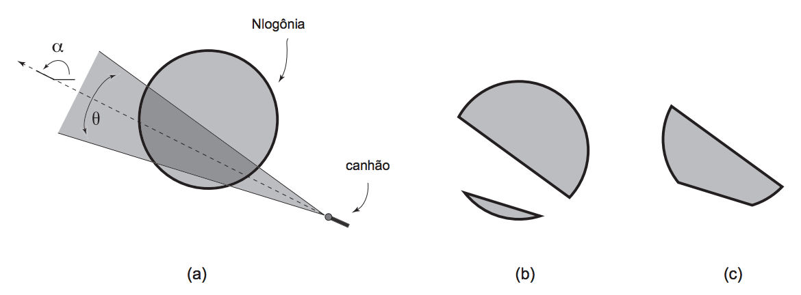

## 문제

Desde que o Rei da Nlogônia construiu, décadas atrás, um enorme muro de proteção ao redor de todo o reino, os seus habitantes vivem em segurança. O muro é imponente, extremamente reforçado, e tem o formato de um círculo que envolve todos os domínios do Rei.

No entanto, há algumas semanas os habitantes da Nlogônia estão apreensivos. Há boatos de que cientistas da Quadradônia, um povo bárbaro que habita as vizinhanças da Nlogônia, desenvolveram uma arma mortal, capaz de pulverizar tudo que esteja em sua mirada.

A nova arma é um canhão que emite um feixe de prótons que se espalha com ângulo*ø* a partir da boca do canhão. A direção do tiro é indicada por um ângulo *alpha*, medido a partir do eixo x, no sentido anti-horário. A figura abaixo ilustra (a) um exemplo de ataque, (b) o que restaria da Nlogônia e (c) a área que seria destruída.

Dados a coordenada do canhão, a direção do tiro e o ângulo de espalhamento do feixe de prótons, bem como a coordenada do centro e o valor do raio do muro de proteção, você deve escrever um programa para calcular a área da Nlogônia que será destruída.

## 입력

A entrada contém vários casos de teste. Cada caso de teste é composto por duas linhas. A primeira linha contém três números inteiros X, Y , R, com (X, Y ) representando as coordenadas do centro do círculo do muro de proteção (0 ≤ X ≤ 1000 e 0 ≤ Y ≤ 1000), e R o seu raio (1≤R≤100). A segunda linha contém quatro números inteiros P , Q, A e T , com (P, Q) representando as coordenadas da localização do canhão (0≤P≤1000 e 0≤Q≤1000), A representando a direção, em graus, do tiro (0≤A≤359), e T representa o ângulo de espalhamento, também em graus (1≤T≤179). O ângulo A é medido a partir do eixo x no sentido anti-horário, e o canhão está sempre fora dos domínios da Nlogônia, ou seja, a distância entre (X, Y ) e (P, Q) é maior do que R.

O final da entrada é indicado por uma linha que contém três zeros separados por espaços em branco.

## 출력

Para cada caso de teste da entrada seu programa deve imprimir uma única linha, contendo um número real, escrito com precisão de uma casa decimal, indicando a área da Nlogônia que seria destruída pelo ataque.
