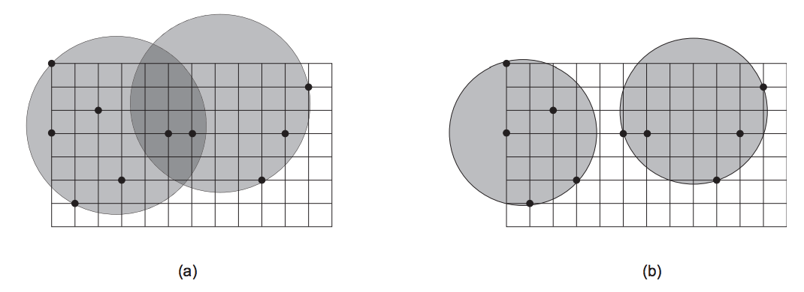

## 문제

Uma nova operadora de telefonia pretende oferecer serviços de telefone residencial em sua cidade. Os telefones serão residenciais, mas a operadora vai utilizar tecnologia de telefonia celular, com torres de transmissão, para evitar os gastos de construir uma rede de cabos por toda a cidade.

A potência do transmissor/receptor colocado em uma torre define o raio de cobertura da torre (que por sua vez define a área de cobertura do equipamento, que é um círculo, já que a cidade é perfeitamente plana). O custo do equipamento instalado em cada torre depende de sua potência, e portanto de seu raio de cobertura.

A operadora decidiu que utilizará exatamente duas torres na cidade. O mesmo tipo de equipamento será instalado nas duas torres, ou seja, as duas torres terão o mesmo raio de cobertura. Como a operadora quer poder oferecer o seu serviço para todas as residências, a área de cobertura das duas torres em conjunto deve englobar todas as resid^encias da cidade. Adicionalmente, o raio de cobertura das duas torres deve ser o menor possível, para miniminar o custo dos equipamentos. A figura abaixo mostra duas possíveis configurações de cobertura das duas torres para uma cidade com dez residências. Tanto (a) quanto (b) oferecem cobertura a todas as residências da cidade, mas (b) é a que utiliza o menor raio de cobertura possível.

Dada a localização de cada residência na cidade, você deve escrever um programa para calcular o menor raio de cobertura das torres, de forma a garantir que todas as residências sejam cobertas.

## 입력

A entrada contém vários casos de teste. A primeira linha de um caso de teste contém um número inteiro N, o número de residências da cidade (3 ≤ N ≤ 40). Cada uma das N linhas seguintes contém dois inteiros X e Y , separados por um espaço em branco (0 ≤ X ≤ 104 e 0 ≤ Y ≤ 104), representando a coordenada de uma residência. Cada residência tem uma localização diferente.

O final da entrada é indicado por uma linha que contém apenas um zero.

## 출력

Para cada caso de teste da entrada seu programa deve imprimir uma única linha, contendo um número real, escrito com precisão de duas casas decimais, indicando o raio de cobertura do equipamento a ser utilizado nas duas torres.

O resultado de seu programa deve ser escrito na saída padrão.
