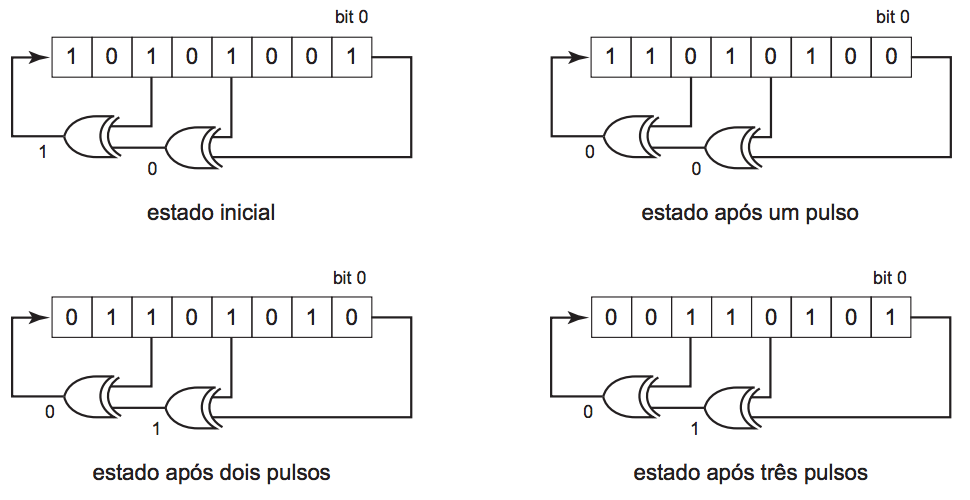

## 문제

Um Registrador de Deslocamento é um circuito que desloca de uma posição os elementos de um vetor de bits. O registrador de deslocamento tem uma entrada (um bit) e uma saída (também um bit), e é comandado por um pulso de relógio. Quando o pulso ocorre, o bit de entrada se transforma no bit menos significativo do vetor, o bit mais significativo é jogado na saída do registrador, e todos os outros bits são deslocados de uma posiçãoo em direção ao bit mais significativo do vetor (em direçãoo à saída).

Um Registrador de Deslocamento com Retroalimentação Linear (em inglês, LFSR) é um registrador de deslocamento no qual o bit de entrada é determinado pelo valor do OU-EXCLUSIVO de alguns dos bits do registrador antes do pulso de relógio. Os bits que são utilizados na retroalimentação do registrador são chamados de torneiras. A figura abaixo mostra um LFSR de 8 bits, com três torneiras (bits 0, 3 e 5).

Neste problema, você deve escrever um programa que, dados o número de *bits* de um LFSR, quais *bits* são utilizados na retroalimentação, um estado inicial e um estado final do LFSR, determine quantos pulsos de relógio serão necessários para que, partindo do estado inicial, o LFSR chegue ao estado final (ou determinar que isso é impossível).

## 입력

A entrada contém vários casos de teste. Cada caso de teste é composto por três linhas. A primeira linha contém dois números inteiros N, T, indicando respectivamente o número de bits (2 ≤ N ≤ 32) e o número de torneiras (2 ≤ T ≤ N). Os bits são identificados por inteiros de 0 (bit menos significativo) a N − 1 (bit mais significativo). A segunda linha contém T inteiros, separados por espaços, apresentando os identificadores dos bits que são torneiras, em ordem crescente. O bit 0 sempre é uma torneira. A terceira linha contém dois números em notação hexadecimal I e F, separados por um espaço em branco, representando respectivamente o estado inicial e o estado final do LFSR.

O final da entrada é indicado por uma linha que contém dois zeros separados por espaços em branco.

## 출력

Para cada caso de teste da entrada seu programa deve imprimir uma única linha. Se for possível chegar ao estado final a partir do estado inicial dado, a linha da saída deve conter apenas um inteiro, o menor número de pulsos de relógio necessários para o LFSR atingir o estado final. Caso não seja possível, a linha deve conter apenas o caractere '\*'.
