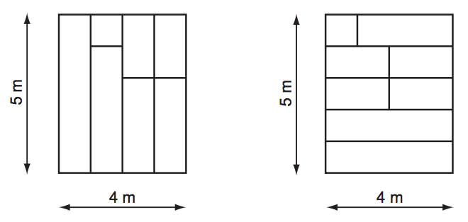

## 문제

O Clube Recreativo de Tinguá está construindo a sua nova sede social. Os sócios desejam que o piso do salão da sede seja de tábuas de madeira, pois consideram que este é o melhor tipo de piso para os famosos bailes do clube. Uma madeireira da região doou uma grande quantidade de tábuas de boa qualidade, para serem utilizadas no piso. As tábuas doadas têm todas a mesma largura, mas têm comprimentos distintos.

O piso do salão da sede social é retangular. As tábuas devem ser colocadas justapostas, sem que qualquer parte de uma tábua seja sobreposta a outra tábua, e devem cobrir todo o piso do salão. Elas devem ser dispostas alinhadas, no sentido longitudinal, e todas devem estar no mesmo sentido (ou seja, todas as tábuas devem estar paralelas, no sentido longitudinal). Além disso, os sócios não querem muitas emendas no piso, e portanto se uma tábua não é longa o bastante para cobrir a distãncia entre um lado e outro do salão, ela pode ser emendada a no máximo uma outra tábua para completar a distância.

Há porém uma complicação adicional. O carpinteiro-chefe tem um grande respeito por todas as madeiras e prefere não serrar qualquer tábua. Assim, ele deseja saber se é possível forrar todo o piso com as tábuas doadas, obedecendo às restrições especificadas; caso seja possível, o carpinteiro-chefe deseja ainda saber o menor número de tábuas que será necessário utilizar.

A figura abaixo ilustra duas possíveis maneiras de forrar o piso de um salão com dimensões 4 × 5 metros para um conjunto de dez tábuas doadas, com 100 cm de largura, e comprimentos 1, 2, 2, 2, 2, 3, 3, 4, 4 e 5 metros.

## 입력

A entrada contém vários casos de teste. A primeira linha de um caso de teste contém dois inteiros M e N indicando as dimensões, em metros, do salão (1 ≤ N,M ≤ 104). A segunda linha contém um inteiro L, representando a largura das tábuas, em centímetros(1 ≤ L ≤ 100). A terceira linha contém um inteiro, K, indicando o número de tábuas doadas (1 ≤ K ≤ 105). A quarta linha contém K inteiros Xi, separados por um espaço, cada um representando o comprimento, em metros, de uma tábua (1 ≤ Xi ≤ 104 para 1 ≤ i ≤ K). O final da entrada é indicado por uma linha que contém apenas dois zeros, separados por um espaço em branco.

## 출력

Para cada um dos casos de teste da entrada, seu programa deve imprimir uma única linha, contendo o menor número de tábuas necessário para cobrir todo o piso do salão, obedecendo às restrições estabelecidas. Caso não seja possível cobrir todo o piso do salão obedecendo às restrições estabelecidas, imprima uma linha com a palavra ‘impossivel’ (letras minúsculas, sem acento).
