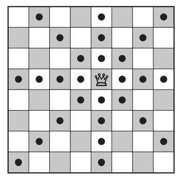

## 문제

O jogo de xadrez possui várias peças com movimentos curiosos: uma delas é a *dama*, que pode se mover qualquer quantidade de casas na mesma linha, na mesma coluna, ou em uma das duas diagonais, conforme exemplifica a figura abaixo:

O grande mestre de xadrez Kary Gasparov inventou um novo tipo de problema de xadrez: dada a posição de uma dama em um tabuleiro de xadrez vazio (ou seja, um tabuleiro 8 × 8, com 64 casas), de quantos movimentos, no mínimo, ela precisa para chegar em outra casa do tabuleiro?

Kary achou a solução para alguns desses problemas, mas teve dificuldade com outros, e por isso pediu que você escrevesse um programa que resolve esse tipo de problema.

## 입력

A entrada contém vários casos de teste. A primeira e única linha de cada caso de teste contém quatro inteiros X1, Y1, X2 eY2 (1 ≤ X1, Y1, X2, Y2 ≤ 8). A dama começa na casa de coordenadas (X1, Y1), e a casa de destino é a casa de coordenadas(X2, Y2). No tabuleiro, as colunas são numeradas da esquerda para a direita de 1 a 8 e as linhas de cima para baixo também de 1 a 8. As coordenadas de uma casa na linha X e coluna Y são (X, Y ).

O final da entrada é indicado por uma linha contendo quatro zeros.

## 출력

Para cada caso de teste da entrada seu programa deve imprimir uma única linha na saída, contendo um número inteiro, indicando o menor número de movimentos necessários para a dama chegar em sua casa de destino.
