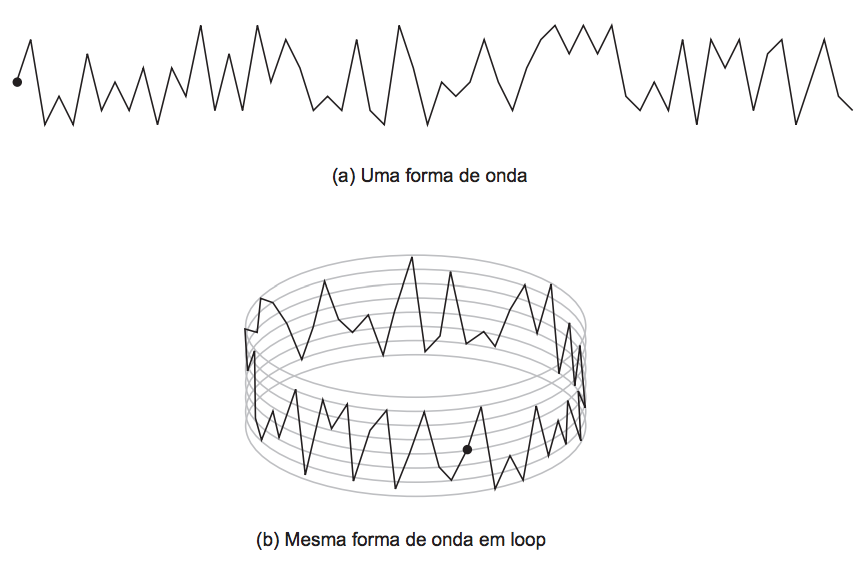

## 문제

Um loop musical é um trecho de música que foi composto para repetir continuamente (ou seja, o trecho inicia novamente toda vez que chega ao final), sem que se note descontinuidade. Loops são muito usados na sonorização de jogos, especialmente jogos casuais pela internet.

Loops podem ser digitalizados por exemplo utilizando PCM. PCM, do inglês Pulse Code Modulation, é uma técnica para representação de sinais analógicos, muito utilizada em áudio digital. Nessa técnica, a magnitude do sinal é amostrada a intervalos regulares de tempo, e os valores amostrados são armazenados em sequência. Para reproduzir a forma de onda amostrada, o processo é invertido (demodulação).

Fernandinha trabalha para uma empresa que desenvolve jogos e compôs um bonito loopmusical, codificando-o em PCM. Analisando a forma de onda do seu loop em um software de edição de áudio, Fernandinha ficou curiosa ao notar a quantidade de “picos” existentes. Um pico em uma forma de onda é um valor de uma amostra que representa um máximo ou mínimo local, ou seja, um ponto de inflexão da forma de onda. A figura abaixo ilustra (a) um exemplo de forma de onda e (b) o loop formado com essa forma de onda, contendo 48 picos.

Fernandinha é uma amiga muito querida e pediu sua ajuda para determinar quantos picos existem no seu loop musical.

## 입력

A entrada contém vários casos de teste. A primeira linha de um caso de teste contém um inteiro N, representando o número de amostras no loop musical de Fernandinha (2 ≤ N ≤ 104). A segunda linha contém N inteiros Hi, separados por espaços, representando a sequência de magnitudes das amostras(-104 ≤ Hi ≤ 104 para 1 ≤ i ≤ N, H1 ≠ HN e Hi ≠ Hi+1 para 1 ≤ i < N). Note que H1 segue HN quando o loop é reproduzido.

O final da entrada é indicado por uma linha que contém apenas o número zero.

## 출력

Para cada caso de teste da entrada seu programa deve imprimir uma única linha, contendo apenas um inteiro, o número de picos existentes no loop musical de Fernandinha.
