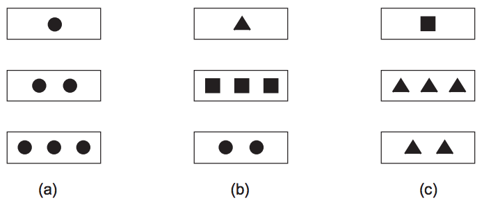

## 문제

Set é um jogo jogado com um baralho no qual cada carta pode ter uma, duas ou três figuras. Todas as figuras em uma carta são iguais, e podem ser círculos, quadrados ou triângulos.

Um set é um conjunto de três cartas em que, para cada característica (número e figura), ou as três cartas são iguais, ou as três cartas são diferentes. Por exemplo, na figura abaixo, (a) é um set válido, já que todas as cartas têm o mesmo tipo de figura e todas elas têm números diferentes de figuras.

Em (b), tanto as figuras quanto os numeros são diferentes para cada carta. Por outro lado, (c) não é um set, já que as duas ultimas cartas têm a mesma figura, mas esta é diferente da figura da primeira carta.

O objetivo do jogo é formar o maior número de sets com as cartas que estão na mesa; cada vez que um set é formado, as três cartas correspondentes são removidas de jogo.

Quando há poucas cartas na mesa, é fácil determinar o maior número de sets que podem ser formados; no entanto, quando há muitas cartas há muitas combinações possíveis. Seu colega quer treinar para o campeonato mundial de Set, e por isso pediu que você fizesse um programa que calcula o maior número de sets que podem ser formados com um determinado conjunto de cartas.

## 입력

A entrada contém vários casos de teste. A primeira linha de cada caso de teste contém um inteiro N (3 ≤ N ≤ 3 × 104), indicando o número de cartas na mesa; cada uma das N linhas seguintes contém a descrição de uma carta.

A descrição de uma carta é dada por duas palavras separadas por um espaço; a primeira, “um”, “dois” ou “tres”, indica quantas figuras aquela carta possui. A segunda, “circulo” (ou “circulos”), “quadrado” (ou “quadrados”) ou “triangulo” (ou “triangulos”) indica qual tipo de figura está naquela carta.

O final da entrada é indicado por uma linha contendo um zero.

## 출력

Para cada caso de teste da entrada seu programa deve imprimir uma única linha na saída, contendo um número inteiro, indicando o maior número de sets que podem ser formados com as cartas dadas.
