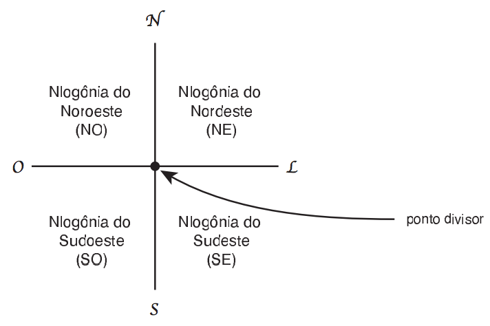

## 문제

Depois de séculos de escaramuças entre os quatro povos habitantes da Nlogônia, e de dezenas de anos de negociações envolvendo diplomatas, políticos e as forças armadas de todas as partes interessadas, com a intermediação da ONU, OTAN, G7 e SBC, foi finalmente decidida e aceita por todos a maneira de dividir o país em quatro territórios independentes.

Ficou decidido que um ponto, denominado ponto divisor, cujas coordenadas foram estabelecidas nas negociações, definiria a divisão do país, da seguinte maneira. Duas linhas, ambas contendo o ponto divisor, uma na direção norte-sul e uma na direção leste-oeste, seriam traçadas no mapa, dividindo o país em quatro novos países. Iniciando no quadrante mais ao norte e mais ao oeste, em sentido horário, os novos países seriam chamados de Nlogônia do Noroeste, Nlogônia do Nordeste, Nlogônia do Sudeste e Nlogônia do Sudoeste.

A ONU determinou que fosse disponibilizada uma página na Internet para que os habitantes pudessem consultar em qual dos novos países suas residências estão, e você foi contratado para ajudar a implementar o sistema.

## 입력

A entrada contém vários casos de teste. A primeira linha de um caso de teste contém um inteiro K indicando o número de consultas que serão realizadas (0 < K ≤ 103). A segunda linha de um caso de teste contém dois números inteiros N e Mrepresentando as coordenadas do ponto divisor (-104 < N, M < 104). Cada uma das K linhas seguintes contém dois inteiros X e Y representando as coordenadas de uma residência (-104 ≤ X, Y ≤ 104).Em todas as coordenadas dadas, o primeiro valor  corresponde à direção leste-oeste, e o segundo valor corresponde à direção norte-sul.

O final da entrada é indicado por uma linha que contém apenas o número zero.

## 출력

Para cada caso de teste da entrada seu programa deve imprimir uma linha contendo:

* a palavra divisa se a residência encontra-se em cima de uma das linhas divisórias (norte-sul ou leste-oeste);
* NO se a residência encontra-se na Nlogônia do Noroeste;
* NE se a residência encontra-se na Nlogônia do Nordeste;
* SE se a residência encontra-se na Nlogônia do Sudeste;
* SO se a residência encontra-se na Nlogônia do Sudoeste.
