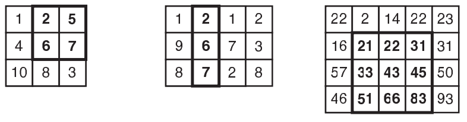

## 문제

Determinar a subseqüência (contígua) crescente de maior comprimento em uma lista de números é um problema já clássico em competições de programação. Este é o problema que você deve resolver aqui, mas para não deixar você bocejando de tédio enquanto o soluciona, introduzimos uma pequena modificação: a lista de números é dada na forma de uma matriz bidimensional e a seqüência de comprimento máximo está “embutida” em uma submatriz da  
matriz original.

Vamos definir mais precisamente o problema. A linearização de uma matriz bidimensional é a justaposição de suas linhas, da primeira à última. Uma submatriz é uma região retangular (de lados paralelos aos da matriz) de uma matriz. O tamanho de uma submatriz é seu número de elementos. Você deve escrever um programa que, dada uma matriz de números inteiros, determine a maior submatriz que, quando linearizada, resulta em uma seqüência crescente.

A figura abaixo mostra alguns exemplos de submatrizes de tamanho máximo que contêm subseqüências crescentes. Note que mais de uma submatriz que contém uma subseqüência de comprimento máximo pode estar presente em uma mesma matriz. Note ainda que numa seqüência crescente não pode haver elementos repetidos: 22, 31, 33 é uma seqüência crescente, ao passo que 22, 31, 31, 33 não é.

## 입력

A entrada contém vários casos de teste. A primeira linha de um caso de teste contém dois inteiros N e M indicando as dimensões da matriz (1 ≤ N, M ≤ 600). Cada uma das N linhas seguintes contém M inteiros, separados por um espaço, descrevendo os elementos da matriz. O elemento Xi,jda matriz é o j-ésimo inteiro da i-ésima linha da entrada(-106 ≤ Xi,j ≤ 106).

O final da entrada é indicado por uma linha que contém apenas dois zeros, separados por um espaço em branco.

## 출력

Para cada um dos casos de teste da entrada seu programa deve imprimir uma única linha, contendo o número de elementos da maior submatriz que, quando linearizada, resulta em uma seqüência crescente.
