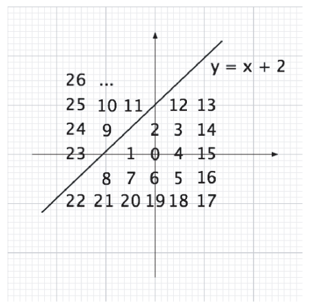

## 문제

Um determinado exército numa certa fronteira decidiu enumerar as coordenadas em sua volta de maneira a tornar difícil para o inimigo saber a quais posições eles estão se referindo no caso de o sinal de rádio usado para comunicação ser interceptado. O processo de enumeração escolhido foi o seguinte: primeiro decide-se onde ficam os eixos x e y; a seguir, define-se uma equação linear que descreva a posição da fronteira em relação aos eixos (sim, ela é uma linha reta); finalmente, enumeram-se todos os pontos do plano cartesiano que não fazem parte da fronteira, sendo o número 0 atribuído à coordenada (0,0) e daí em diante atribuindo-se os números para as coordenadas inteiras seguindo uma espiral de sentido horário, sempre pulando os pontos que caem em cima da fronteira (veja a Figura 1). Caso o ponto (0,0) caia em cima da fronteira, o número 0 é atribuído ao primeiro ponto que não faça parte da fronteira seguindo a ordem especificada.

  
Figura 2: Enumeração dos pontos das coordenadas inteiras

De fato o inimigo não tem como saber a qual posição o exército se refere, a não ser que o inimigo saiba o sistema usado para enumerar os pontos. Tal esquema, porém, complicou a vida do exército, uma vez que é difícil determinar se dois pontos quaisquer estão no mesmo lado da fronteira ou em lados opostos. É aí que eles precisam da sua ajuda.

## 입력

A entrada contém vários casos de teste. A primeira linha da entrada contém um inteiro N (1 ≤ N ≤ 100) que representa a quantidade de casos de teste. Seguem-se os N casos de teste. A primeira linha de cada caso de teste contém dois inteiros a e b (−5 ≤ a ≤ 5 e −10 ≤ b ≤ 10), que descrevem a equação da fronteira: y = ax + b. A segunda linha de cada caso de teste contém um inteiro K, indicando a quantidade de consultas que se seguem (1 ≤ K ≤ 1000). Cada uma das K linhas seguintes descreve uma consulta, sendo composta por dois inteiros M e N representando as coordenadas enumeradas de dois pontos (0 ≤ M, N ≤ 65535).

## 출력

Para cada caso de teste da entrada seu programa deve produzir K + 1 linhas. A primeira linha deve conter a identificação do caso de teste na forma Caso X, onde X deve ser substituído pelo número do caso (iniciando de 1). As K seguintes devem conter os resultados das K consultas feitas no caso correspondente da entrada, na forma:

`Mesmo lado da fronteira`

ou

`Lados opostos da fronteira`
