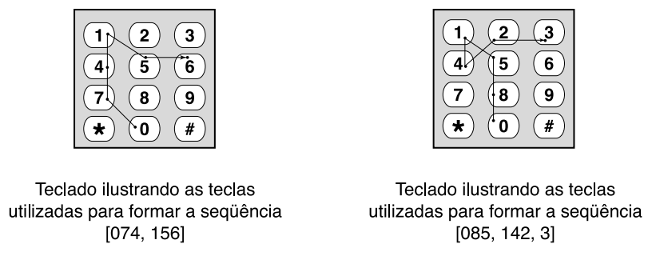

## 문제

Strike Boy, como o apelido sugere, é um garoto fanático por todo tipo de jogos em computador. Ele está passando as férias em uma ilha paradisíaca, onde computadores não são permitidos. Ele se divertiu por algum tempo com os jogos em seu telefone celular, mas a bateria acabou e não há eletricidade na ilha, de forma que ele parou de jogar. Strike Boy então decidiu inventar um novo passatempo, usando o teclado de seu telefone celular. Neste novo jogo, para dois jogadores, um deles escolhe dois inteiros *S* e *D*. O jogador oponente deve então encontrar uma sequência de termos tal que:

* Cada termo da sequência é um número com *D* dígitos decimais, exceto pelo último termo, que pode ter entre 1 e *D*dígitos;
* A soma de todos os termos da sequência é igual a *S*;
* Os dígitos utilizados para formar um termo correspondem às teclas de um teclado padrão de telefone celular (‘0’ a ‘9’);
* Cada dígito é utilizado no máximo uma vez na sequência;
* O primeiro termo de uma sequência pode começar com qualquer dígito, mas a ordem dos dígitos da sequência, quando lidos da esquerda para a direita, é tal que a próxima tecla corresponde sempre a uma tecla imediatamente vizinha da tecla utilizada previamente (na vertical, na horizontal ou na diagonal).

Por exemplo, se *S* = 230 e *D* = 3, há apenas duas soluções possíveis obedecendo as regras do jogo: [074, 156] e [085, 142, 3]. A sequência [230] não é uma solução porque a tecla ‘3’ não é vizinha da tecla ‘0’.

Ajude Strike Boy a verificar se as respostas do oponente estão corretas: escreva um programa que, dados *S* e *D*, imprima todas as soluções possíveis.

## 입력

A entrada contém vários casos de teste. Cada caso de teste consiste em apenas uma linha, contendo dois inteiros S e D, separados por um espaço, representando a soma desejada e o número de dígitos de cada termo (0 ≤ S ≤ 10.000.000.000 e 1 ≤ D ≤ 10). O final da entrada é indicado por S = D = −1.

## 출력

Para cada caso de teste da entrada seu programa deve produzir uma resposta. A primeira linha de uma resposta deve conter um identificador do caso de teste, no formato '#i', onde 'i' tem inicialmente o valor 1 e é incrementado a cada caso de teste. Então, se uma solução para o passatempo existe, seu programa deve produzir uma lista das possíveis sequências de termos. Se mais de uma sequência é possível, elas devem aparecer em ordem lexicográfica crescente. Cada sequência de termos deve ser impressa em uma linha, com os termos separados por um espaço em branco. Se não há solução, seu programa deve imprimir uma linha contendo a palavra 'impossivel' (note ausência de acentuação).

*Definição:* considere as sequências *Sa* = a1a2... a*m* e *Sb* = b1b2 ... b*n*. *Sa* precede *Sb* em ordem lexicográfica se e apenas se Sbé não-vazia e uma das seguintes condições é verdadeira:

* Sa é uma sequência vazia;
* a1 < b1;
* a1 = b1 e a sequência a2a3 ... am precede a sequência b2b3 ... bn.
