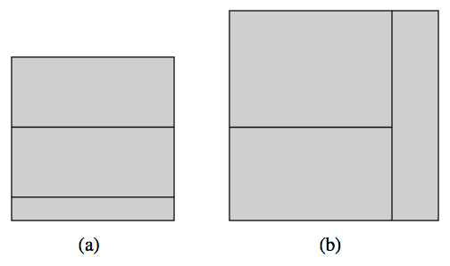

## 문제

Given the dimensions of three rectangles, determine if all three can be glued together, touching just on the edges, to form a square. You may rotate the rectangles. For example, Figure C.1 shows successful constructions for the first two sample inputs.

Figure C.1: Constructions for the first two examples

## 입력

The input consists of three lines, with line j containing integers Hj and Wj , designating the height and width of a rectangle, such that 100 ≥ Hj ≥ Wj ≥ 1, and such that H1 ≥ H2 ≥ H3.

## 출력

Output a line saying YES if they can be glued together to form a square. Output NO otherwise.
