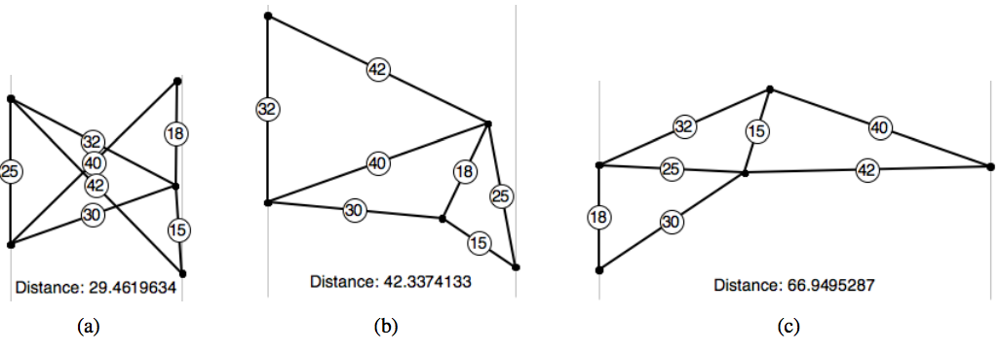

## 문제

Alaa fondly remembers playing with a construction toy when she was a child. It consisted of segments that could be fastened at each end. A game she liked to play was to start with one segment as a base, placed flat against a straight wall. Then she repeatedly added on triangles, with one edge of the next triangle being a single segment already in place on her structure, and the other two sides of the triangle being newly added segments. She only added real triangles: never with the sum of the lengths of two sides equaling the third. Of course no segment could go through the wall, but she did allow newly added segments to cross over already placed ones. Her aim was to see how far out from the wall she could make her structure go. She would experiment, building different ways with different combinations of some or all of her pieces. It was an easy, boring task if all the segments that she used were the same length! It got more interesting if she went to the opposite extreme and started from a group of segments that were all of distinct lengths.

For instance, the figures below illustrate some of the structures she could have built with segments of length 42, 40, 32, 30, 25, 18 and 15, including one that reaches a maximum distance of 66.9495 from the wall.

Figure E.1: Candidate constructions for example lengths, with the wall at left in each

Now, looking back as a Computer Science student, Alaa wondered how well she did, so she has decided to write a program to compute the maximum distance given a set of segment lengths.

## 입력

The input is a single line of positive integers. The first integer n designates the number of segments, with 3 ≤ n ≤ 9. The following n integers, l1 > l2 > · · · > ln designate the lengths of the segments, such that 1 ≤ lj ≤ 99 for all j. The lengths will permit at least one triangle to be constructed.

## 출력

Output is the maximum distance that one of Alaa’s structures can reach away from the wall, stated with a relative or absolute error of at most 10−2 . The input data is chosen so that any structure acheiving the maximum distance has all vertices except the base vertices at least 0.0001 from the wall.
