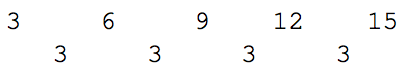
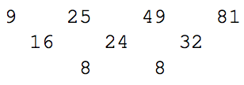

## 문제

While mostly known for the programs she wrote for Charles Babbage’s Analytic Engine, Augusta Ada KingNoel, Countess of Lovelace, described how the method of finite differences could be used to solve all types of problems involving number sequences and series. These techniques were implemented in Babbage’s Difference Engine.

The algorithm: If we compute the difference between consecutive values in a numeric sequence, we will obtain a new sequence which is related to the derivative of the function implied by the original sequence. For sequences generated from first-order polynomials (linear functions) the successive differences will be a list of identical values, (i.e., a constant difference). For second-order polynomial functions the lists of differences will be a new sequence whose values change linearly. In turn, the list of differences of the values in this generated list (i.e., the finite differences of the list of differences) will be constant, and so on for higher-order polynomials. In general the n th row of differences will be constant for an n th degree polynomial.

For example, the first-order polynomial 3x+ 3 produces the sequence below at x = 0, 1, 2, 3, 4, and the first differences are shown on the following line.

As another example, the polynomial x 2 , if evaluated at inputs x = 3, 5, 7, 9, produces the sequence below.

Furthermore, if we consider a minimum-order polynomial that produces the original sequence, its value at the next regularly spaced input can be predicted by extending the difference table.

## 입력

The input consists of a value n, designating the number of polynomial evaluations given with 2 ≤ n ≤ 10, follwed by n values v1, v2, . . . vn which represent the value of a polynomial when evaluated at n regularly spaced input values. Each vj will satisfy −2 000 000 ≤ vj ≤ 2 000 000 and at least two of those values will differ from each other.

## 출력

Output two integer values d and vn+1, separated by a space. The value d must be the degree of a minimaldegree polynomial producing the original sequence, and vn+1 must be the value of the polynomial if evaluated at the next regularly spaced input value.
