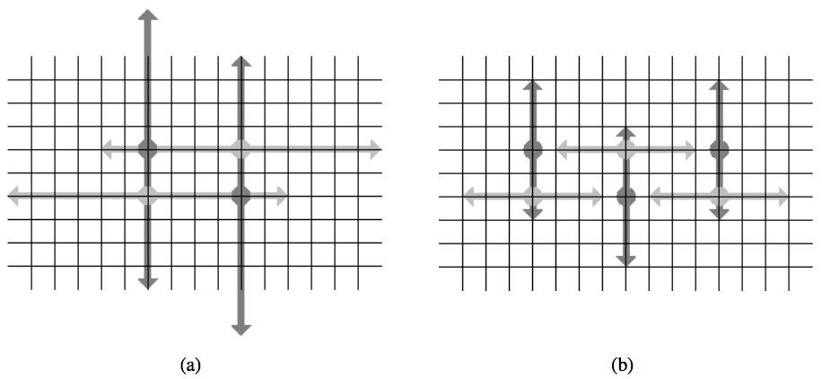

## 문제

In the 1984 GhostbustersTM movie, the protagonists use proton pack weapons that fire laser streams. This leads to the following memorable dialog between scientists Peter Venkman and Egon Spengler:

Spengler: There’s something very important I forgot to tell you.  
Venkman: What?  
Spengler: Don’t cross the streams.  
Venkman: Why?  
Spengler: It would be bad.  
Venkman: I’m fuzzy on the whole good/bad thing. What do you mean, "bad"?  
Spengler: Try to imagine all life as you know it stopping instantaneously and every molecule in your body exploding at the speed of light.  
Venkman: Right. That’s bad. Okay. All right. Important safety tip.

In the 30+ years since that time, there have been several technical advances in their weapons systems:

* The laser streams have been polarized, firing either horizontally or vertically. There is no longer any danger if streams having opposite polarity cross each other. However, there will still be catastrophic results if two streams having the same orientation in any way touch each other.
* A weapon now simultaenously fires its streams in opposite directions. More specifically, a weapon has an integer power P and when fired will reach locations P units to the left and P units to the right of the ghostbuster, if fired horizontally, or P units above and below the ghostbuster if fired vertically.

When stationed at their positions, the ghostbusters can communicate to decide who will fire horizontally and who will fire vertically. They will all use the same power value P and would like to use as much power as possible without causing catastrophe. As an example, Figure H.1(a) shows a configuration of ghostbusters in which an arbitrarily large power value can be used, so long as the ghostbusters coordinate their orientations. Figure H.1(b) shows a configuration in which there is an orientation to allow power level 3, but for which no orientation allows power level 4. (Notice that the streams of the bottom-left and bottom-right ghostbusters would touch if using power level 4 with that same orientation of streams.)

Figure H.1: Example configurations for the first two sample inputs

## 입력

The first line contains an integer N, such that 1 ≤ N ≤ 4 000, indicating the number of ghostbusters. Following that are N lines, each containing integers x and y which describe the location of one ghostbuster, such that 0 ≤ x, y ≤ 1 000 000. No two ghostbusters are at the same location.

## 출력

If the ghostbusters can use arbitrarily large power without catastrophe, output UNLIMITED. Otherwise output the largest integral power value that may be safely used with appropriately chosen orientations.
