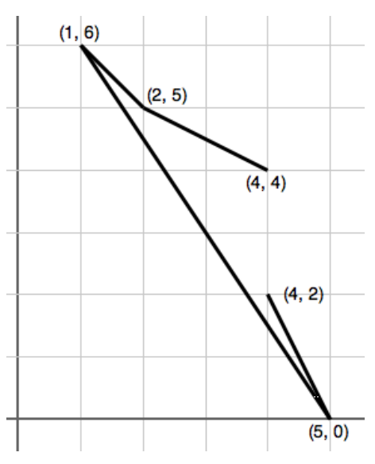

## 문제

Consider following along the path in the figure above, starting from (4, 4) and moving to (2, 5). Then the path turns rightward toward (1, 6), then sharp left to (5, 0) and finally sharp left again to (4, 2). If we use ‘L’ for left and ‘R’ for right, we see that the sequence of turn directions is given by ‘RLL’. Notice that the path does not cross itself: the only intersections of segments are the connection points along the path.

Consider the reverse problem: Given points in an arbitrary order, say (2, 5),(1, 6),(4, 4),(5, 0),(4, 2), could you find an ordering of the points so the turn directions along the path are given by ‘RLL’? Of course to follow the path in the figure, you would start with the third point in the list (4, 4), then the first (2, 5), second (1, 6), fourth (5, 0), and fifth (4, 2), so the permutation of the points relative to the given initial order would be: 3 1 2 4 5.

## 입력

The first line of the input contains an integer N, specifying the number of points such that 3 ≤ N ≤ 50. The following N lines each describe a point using two integers xi and yi such that 0 ≤ xi , yi ≤ 1000. The points are distinct and no three are collinear (i.e., on the same line). The last line contains a string of N − 2 characters, each of which is either ‘L’ or ‘R’.

## 출력

A permutation of {1, . . . , N} that corresponds to a nonintersecting path satisfying the turn conditions. The numbers are to be displayed with separating spaces. (There are always one or more possible solutions, and any one may be used.)
