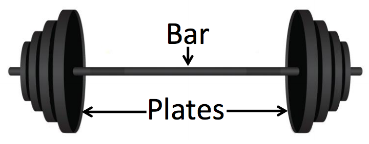

## 문제

Your local gym has b bars and p plates for barbells. In order to prepare a weight for lifting, you must choose a single bar, which has two sides. You then load each side with a (possibly empty) set of plates. For safety reasons, the plates on each side must balance; they must sum to the same weight. The combination of plates on either side might be different, but the total weight on either side must be the same. What weights are available for lifting?

## 입력

Each input will consist of a single test case. Note that your program may be run multiple times on different inputs. The first line of input contains two integers, b and p (1 ≤ b,p ≤ 14), representing the number of bars and plates. Then, there are b lines each containing a single integer x (1 ≤ x ≤ 108 ) which are the weights of the bars. After that, there are p lines each containing a single integer y (1 ≤ y ≤ 108 ) which are the weights of the plates.

## 출력

Output a sorted list of all possible lifting weights, one per line. There must be no duplicates.
