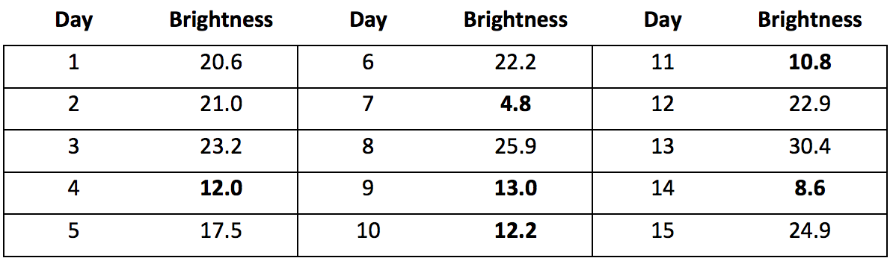

## 문제

Project Panoptes (projectpanoptes.org) will attempt to use low-cost robotic telescopes to collect data, in order to find exoplanets (planets outside of our solar system). For this program you will implement a simple version of software to detect exoplanets from readings from these telescopes.

The telescope will take daily readings of the brightness of a star. If the brightness of the star decreases, a planet may be passing in front of it. If the brightness decreases following a regular pattern, it is a candidate for having an exoplanet.

For example, consider the daily readings of a star's brightness below:

The average of these readings is 18. If a reading is less than 80% of the average of all readings, it is considered to have decreased, so readings below 14.4 are considered to be potential planet sightings (and are highlighted here). The readings at days 4, 9, and 14 happen every fifth day (and thus has a period of 5) and may be because of an exoplanet. Similarly, the readings for day 7 and 14 may indicate an exoplanet. Days 4, 7, and 10 do not form a pattern because it would also have to include day 1 and day 13. Only integer length periods should be considered.

## 입력

Each input will consist of a single test case. Note that your program may be run multiple times on different inputs. The first line of input contains two integers, n (2 ≤ n ≤ 1,000) and p (1 ≤ p ≤ n-1), where n is the number of observations, and p is the minimum period length to consider. Each of the next n lines will contain a floating point number x (0.0 ≤ x ≤ 100.0), which is the brightness for that day. The days will be in order.

## 출력

Output a single integer, indicating the smallest possible period of an exoplanet (must be ≥ p), or -1 of there is none.
