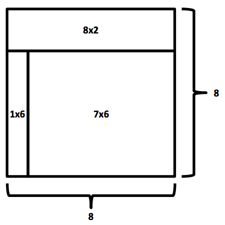

## 문제

Given three rectangles, determine if they can be glued together to form a square. The rectangles can be rotated, but they cannot overlap.

Here’s an example of how three rectangles, 8x2, 1x6 and 7x6, can be put together to form a square 8x8:

## 입력

Each input will consist of a single test case. Note that your program may be run multiple times on different inputs. There will be exactly three lines of input.

The first line of input contains two integers w1 and h1 (1 ≤ w1,h1 ≤ 100), which are the width and height of the first rectangle.

The second line of input contains two integers w2 and h2 (1 ≤ w2,h2 ≤ 100), which are the width and height of the second rectangle.

The third line of input contains two integers w3 and h3 (1 ≤ w3,h3 ≤ 100), which are the width and height of the third rectangle.

## 출력

Output 1 if the two rectangles can be put together to form a square, and 0 of they cannot.
