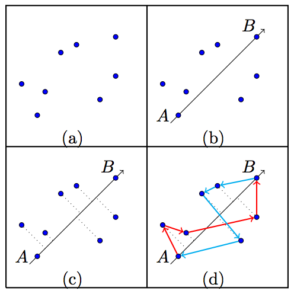

## 문제

Your country is about to install a new hyperfast broadband network based on an advanced technology, which allows a single unidirectional link to carry any amount of data traffic at any speed. Each such link runs straight between its endpoints, similar to an ideal laser beam. Given the unidirectional nature of the connections and the astronomic expense of link endpoints, the network’s nodes will be connected in a ring (a ring is a connected graph where each node has exactly one input and one output). This will minimise the expense given the constraint that each node in the network must be able to send data to, and receive data from, each other node (either directly or via intermediate nodes). There is an election looming and although there is bipartisan agreement on the list of potential locations, the government and opposition disagree on which of the potential locations should be nodes on the network.

The opposition, which favours fiscal rigour, is attempting to sound impressive while keeping the cost down:

“Our network will include just enough nodes such that if these are then connected into a ring with minimal total link length, then every location will either be on the network, directly passed over by a link, or in the area enclosed by the network.”

In contrast, the government, which favours equality of network access and does not hesitate to spend taxpayers’ money, insists that all the potential locations will be part of the network. As the government’s Chief Computationalist, you meet with the Communications Minister to hear the government’s further requirements:

“We need a connection scheme that we can explain to the public in a simple way. To achieve this, even though a ring doesn’t really have ends, I want two nodes, say A and B, to be nominated as the ring endpoints and an ‘Appropriate Coordinate Map’ (ACM) set up with the origin at A and the positive x−axis oriented to pass through B, whose distance unit is the same as our usual one. The ring must then be constructed such that the path through the ring from A to B is in non-decreasing order of the ACM x−axis and the path from B to A is in non-increasing order of the ACM x−axis. This will enable me to explain A to B as a consistent outward leg, and B to A as a similarly consistent return leg. As there may be more than one network that meets this consistency requirement, I want one that does so and maximises the minimum magnitude (absolute value) of the difference between ACM x−values of successive nodes in the ring. Work out the relevant magnitude and get back to me.”

Now it’s up to you! You can assume that links on one leg can cross links or nodes on the other leg without interference. (The third sample input illustrates a case of one leg crossing the other.) Although this non-interference would actually be achieved by having things at different heights, you can treat this as a 2D problem.

Figure 1: (a) The set of points; (b) Pick A and B (this also defines the ACM x−axis); (c) Each point has an x−value based on the ACM x−axis; (d) One example of a valid ring.

## 입력

The input will contain a single test case.

The input will begin with a line containing the number of potential locations, N (3 ≤ N ≤ 100 000). The next N lines each contain two integers: the x− and y−coordinates of each potential location (−109 ≤ x, y ≤ 109 ). These N points will be distinct. The potential locations are such that the opposition’s network would involve at least 3 and at most 30 nodes.

## 출력

Output one real number being the value that the Communications Minister seeks. Any value that is within 10−3 of the correct answer will be considered correct.
