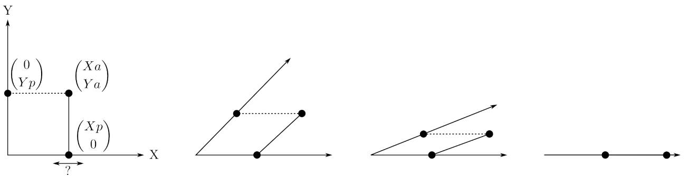

## 문제

The greeting card crisis is at hand, but have you noticed laser cutters becoming available everywhere? This means it’s time for the pop-up card renaissance!

Making a card that folds can be time-consuming without software, but as you are about to prove, this is well within the reach of a blitz hackathon. Keeping it simple for the initial version, we are going to deal with four planar polygons, joined along four lines (hinges), which are parallel to each other at all times. Call the common direction of those hinges the z direction. Note that we can simply deal with the projection of this structure onto the z = 0 plane, and so we will omit the z coordinate from further discussion.

We start with the two pages of the card at 90° to each other, represented by the positive x and y axes. For simplicity, consider them to extend infinitely far. Our folding structure is then described by a point in the first quadrant and two line segments joining that point to each of the two pages. As the card folds, the two pages rotate towards each other and, if the line segments are chosen appropriately, the whole structure folds flat without getting stuck at any time. At the end of the folding process they should all become collinear. We do not allow either the pages or the line segments to bend, stretch, crease or become disconnected from their hinges. Also, the angle between the pages may never exceed 90°.

We let the user draw a single line segment connected to the x-axis, with the other end positioned anywhere in the first quadrant, as appropriate to their design concept. We then supply suggestions for the second line segment to support the first by connecting it with the other page while satisfying the folding requirement. If no options exist, we adjust the input by the smallest amount possible until at least one option becomes available. The particular quantity we are interested in now is the smallest distance to move the point where the user-supplied line segment contacts the x-axis.

## 입력

The input will contain multiple test cases.

Each test case appears on a line of its own and will consist of three integers, separated by single spaces: Xa (1 ≤ Xa ≤ 2 000), Ya (1 ≤ Ya ≤ 2 000) and Xp (1 ≤ Xp ≤ 2 000). These describe the line segment drawn by the user: from the point (Xp, 0) to the point (Xa, Ya).

The input is terminated by three space-separated zeros on a line. There are at most 1 500 test cases.

## 출력

For each test case, print a non-negative floating-point number on a line by itself, giving the smallest distance that Xp should be moved by, such that we could then add some line segment from (Xa, Ya) to some (0, Yp) so the card will close flat. (Note that Yp > 0, of course.)

Responses will be judged correct as long as they are within 10−3 of the true answer. As a technical note, to make this terminology precise, the true answer is defined as the smallest number such that valid distances may be found arbitrarily close to it (see ‘Explanation of Sample Input’ for an example of this).

## 힌트

The first test case is shown in the diagram above. In this case there is no need to move Xp, because if we draw the segment from (1, 1) to (0, 1), dashed in the diagram, the result is a structure folding flat as shown.

In the third case, any distance strictly greater than 7.5 (and less than 20) leads to a valid card.
