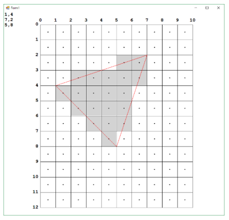

## 문제

In computer graphics, one of the fundamental operations is rasterizationof a triangle. Given pixel coordinates of the corners of a triangle, the rasterization algorithm decides which pixels to colour. Consider the following image. It shows a ‘screen’ with 12 rows of 10 columns of pixels. The coordinate system used for triangle vertices is as shown - integer values at the edges of the pixels. Pixel centres are at half integral coordinates. The coordinates of the corners of the triangle are shown at the top left of the image, with the x or horizontal coordinate first and y coordinate second. Note that the y coordinate increases downward. The coordinates of the triangle follow a standard graphics convention in that they are listed in clockwise order. Any cyclic permutation of the three corners is considered equivalent.

The rasterization technique chosen is to colour a pixel if and only if its centre is inside the triangle, or on an edge of the triangle. With integer coordinates for the corners it is possible (and required) to decide whether a pixel centre lies exactly on the line or not.

Your task is, given the coordinates of the corners of a triangle, calculate the number of pixels coloured following the technique described. In the example shown 20 pixels are coloured.

## 입력

Input will consist of a sequence of problems. There will be one line for each problem. A problem line will hold a space separated series of integers: x1, y1, x2, y2, x3, y3. All x and y coordinates will be in the range 0 to 2000 inclusive. You may assume that the screen size is 2000 by 2000. End of input will be denoted by a line with six zeroes (which should not be processed).

## 출력

Output will be a single line per problem, with the number of coloured pixels.
