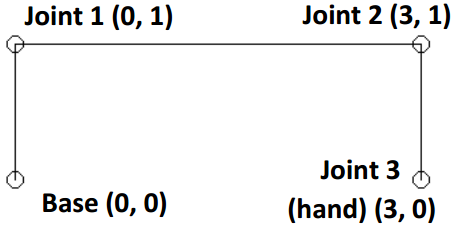

## 문제

Moving a robot arm is a surprisingly complex process. If the arm has a number of segments, the angles of each joint combine to determine the final position of the ‘hand’. In most industrial robotics, the setting of the individual joint angles is left to software and the robot’s operator just specifies where they want the hand to be. The process for determining suitable angles is called Inverse Kinematics. This problem asks you to find an Inverse Kinematic solution for a robot arm with up to 30 segments of different lengths.

Fortunately your robot arm has limitations on its joint angles. The arm is anchored at its starting point or base bottom left joint in the diagram and can pivot freely about that anchor. All the other joints are required to have identical angles. In the diagram the arm is anchored at coordinate (0, 0) The first segment is pivoted by 90 degrees (anticlockwise from the horizontal). The angles at joints 1 and 2 are also 90 degrees (anticlockwise). Segment lengths are 1, 3, and 1 respectively. As a result the hand is at location (x = 3, y = 0).

Your task, given an arm description and a location for the hand is to determine the two angles (pivot of the base) and common angle used by the remaining joints.

## 입력

Input will consist of a sequence of problems. The first line for each problem will have three space separated numbers: N, X and Y. N is the number of segments: 2 <= N <= 30. X and Y are the required coordinates for the hand and will be floating point values. This line will be followed by N lines, holding the lengths of the segments (floating point values). Segment lengths and the X and Y coordinates will all be in the range 1 to 10 (inclusive). End of input will be denoted by a line with three zeroes (which should not be processed).

## 출력

Output will be a single line per problem, two space separated values the pivot angle at the base and the common angle of the remaining joints. Angles will be rounded floating point values output with exactly 3 decimal digits. They will represent angles in degrees. Input data has been chosen to avoid marginal rounding values on the last digit. Angles will always be in the range 0 to 180 degrees (inclusive)
