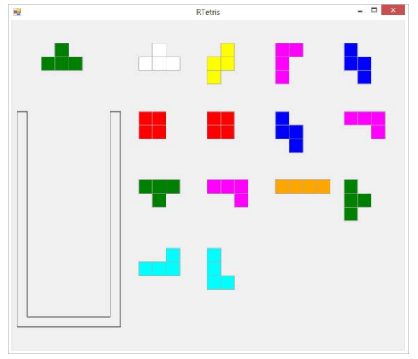
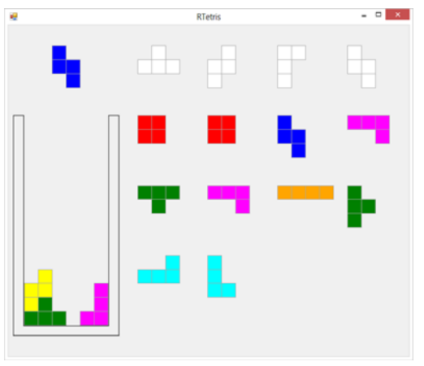
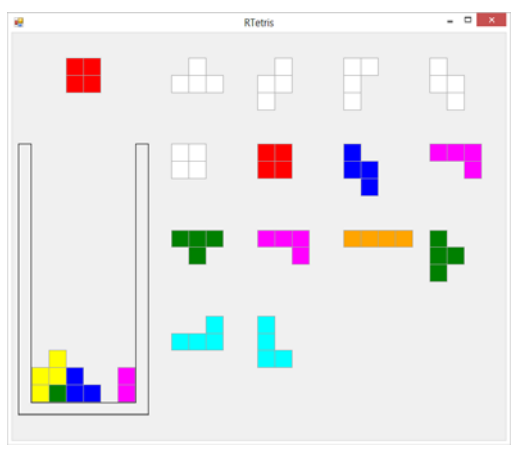
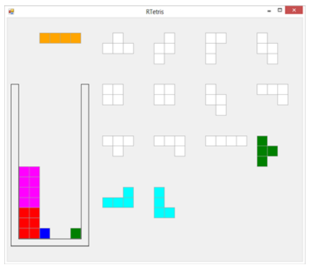
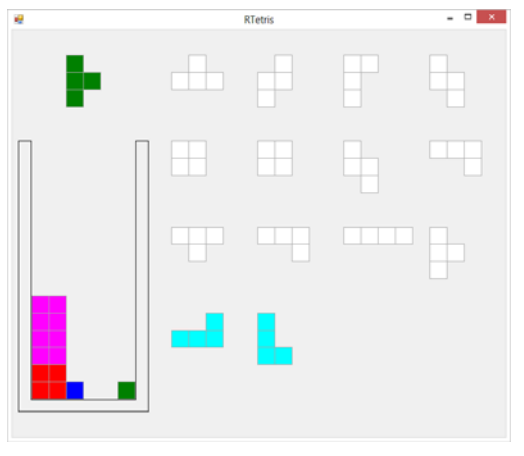
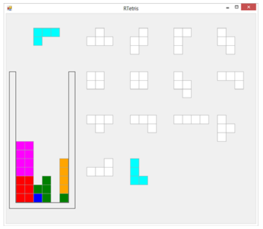
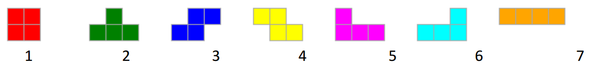

## 문제

It is a little knownfact that the rules of the modern Tetris game have been eased to accommodate the limitations and attitudes of soft modern people. Back in the day, the game, then known as rtetris (the rt being pronounced as in ancient Klingon) was tougher. Play was public, and players who did not do well were subject to ritual humiliation, and occasionally (if things got out of hand) internet deprivation by the so- called ‘denial of rtetris’ attack (DOR for short). Rewards for winners, on the other hand were great. As always in sports, the intense pressure led to a culture of cheating. Cheating took two main forms: the ubiquitous steroid abuse in which players took steroid inhibiting drugs to prevent their overworked fingers developing muscle that would slow keyboard action; and the use of “helper” algorithms to generate game play strategies.

There is to be a revival of Rtetris and to assist top players (by which we mean cheats) you (a programmer with a lust for glory, and minimal ethics) have been asked to recreate one of the ancient “helper” algorithms.

The game of Rtetris works as follows. Like ordinary Tetris, there is a pit, into which pieces are dropped. The pit has integer width and height. Pieces are made of four unit blocks. There are seven distinct piece types.

The game proceeds as a series of plays. On each play, a piece is positioned above the pit. The player can rotate it in multiples of 90 degrees; and move it left or right. When satisfied, they drop the piece into the pit. It moves down as far as possible, with the constraint that it cannot overlap the bottom of the pit or any other piece already in the pit. If the piece cannot fall to a level completely inside the pit, the game ends. Next, the piece can be thought of as disassembling into its four constituent unit blocks. The game then checks for full rows of blocks. Full rows are removed and the blocks above them drop down a level to fill the vacated spaces. To this point the game is just like modern Tetris. Next however, there is a new test. No vertical column of blocks is permitted to have gaps in it after a move has completed. If there is a column with a gap the game ends.

RTetris also differs from modern Tetris, in that there are a fixed number of pieces available for play (the hand), generated randomly before the start of play, and the whole hand for a game is visible to the player. It is therefore possible to win a game, by placing the whole set of pieces under the conditionsspecified above. There are also games where the player loses immediately. If for example the first piece is then there is no way of dropping it into the pit without violating the “columns may not have gaps” rule.

Visibility of all pieces leads to the game having deeper play strategies than modern Tetris. Your “helper” program must analyse game hands to find winning play strategies. Championship games were often played with very large hands.

Note: See ‘Input’ below for the actual pit size in use. Knowing this may be helpful in algorithm development.

Here is an initial game state – playing with a 6 by 15 cell pit and a 14 piece hand. Note that the first piece has been moved over the pit, and is shown in outline in the hand. Pieces are played from the hand in the order dealt .

A little later, three pieces have been played and the fourth is in play (left below). Dropping the fourth piece will remove the bottom row, but leaves the game with a losing position (right below).

=>

Further into the game, playing a different strategy, a new situation arises. Dropping the horizontal piece looks as though it might leave gaps, but the fact that it completes a row makes it legitimate.

=>

Here is another situation where a drop leads to a valid position, and a possible game win.

## 입력

A series of games. Each game starts with a line having three integers separated by spaces: N being hand size (1 <= N <= 200), W and H being pit width and height respectively. Your team has bribed a referee, and you know that W will always be 6, and H will always be 7. Next is a line with the pieces of the hand. Each piece is identified by a digit from 1 to 7, as shown below. Digits are separated by spaces. End of input is signalled by a line with three zeroes.

## 출력

One line per game with either “Game cannot be won”, or “Gamecan be won with N lines removed”, where N is the largest possible number of lines removed for a winning solution. Ie: you are required to find the number of lines removed in a best winning solution, where best means ‘most lines removed’.
