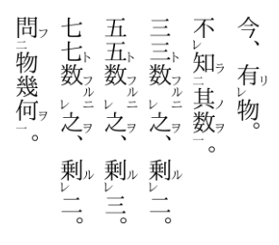

## 문제

Taro, a junior high school student, is working on his homework. Today’s homework is to read Chinese classic texts.

As you know, Japanese language shares the (mostly) same Chinese characters but the order of words is a bit different. Therefore the notation called “returning marks” was invented in order to read Chinese classic texts in the order similar to Japanese language.

There are two major types of returning marks: ‘Re’ mark and jump marks. Also there are a couple of jump marks such as one-two-three marks, top-middle-bottom marks. The marks are attached to letters to describe the reading order of each letter in the Chinese classic text. Figure 1 is an example of a Chinese classic text annotated with returning marks, which are the small letters at the bottom-left of the big Chinese letters.

  
Figure 1: a Chinese classic text

Taro generalized the concept of jump marks, and summarized the rules to read Chinese classic texts with returning marks as below. Your task is to help Taro by writing a program that interprets Chinese classic texts with returning marks following his rules, and outputs the order of reading of each letter.

When two (or more) rules are applicable in each step, the latter in the list below is applied first, then the former.

1. Basically letters are read downwards from top to bottom, i.e. the first letter should be read (or skipped) first, and after the i-th letter is read or skipped, (i + 1)-th letter is read next.
2. Each jump mark has a type (represented with a string consisting of lower-case letters) and a number (represented with a positive integer). A letter with a jump mark whose number is 2 or larger must be skipped.
3. When the i-th letter with a jump mark of type t, number n is read, and when there exists an unread letter L at position less than i that has a jump mark of type t, number n + 1, then L must be read next. If there is no such letter L, the (k + 1)-th letter is read, where k is the index of the most recently read letter with a jump mark of type t, number 1.
4. A letter with a ‘Re’ mark must be skipped.
5. When the i-th letter is read and (i − 1)-th letter has a ‘Re’ mark, then (i − 1)-th letter must be read next.
6. No letter may be read twice or more. Once a letter is read, the letter must be skipped in the subsequent steps.
7. If no letter can be read next, finish reading.

Let’s see the first case of the sample input. We begin reading with the first letter because of the rule 1. However, since the first letter has a jump mark ‘onetwo2’, we must follow the rule 2 and skip the letter. Therefore the second letter, which has no returning mark, will be read first.

Then the third letter will be read. The third letter has a jump mark ‘onetwo1’, so we must follow rule 3 and read a letter with a jump mark ‘onetwo2’ next, if exists. The first letter has the exact jump mark, so it will be read third. Similarly, the fifth letter is read fourth, and then the sixth letter is read.

Although we have two letters which have the same jump mark ‘onetwo2’, we must not take into account the first letter, which has already been read, and must read the fourth letter. Now we have read all six letters and no letter can be read next, so we finish reading. We have read the second, third, first, fifth, sixth, and fourth letter in this order, so the output is 2 3 1 5 6 4.

## 입력

The input contains multiple datasets. Each dataset is given in the following format:

```

N 
mark1 
. 
. 
. 
markN
```

N, a positive integer (1 ≤ N ≤ 10,000), means the number of letters in a Chinese classic text. marki denotes returning marks attached to the i-th letter.

A ‘Re’ mark is represented by a single letter, namely, ‘v’ (quotes for clarity). The description of a jump mark is the simple concatenation of its type, specified by one or more lowercase letter, and a positive integer. Note that each letter has at most one jump mark and at most one ’Re’ mark. When the same letter has both types of returning marks, the description of the jump mark comes first, followed by ‘v’ for the ‘Re’ mark. You can assume this happens only on the jump marks with the number 1.

If the i-th letter has no returning mark, marki is ‘-’ (quotes for clarity). The length of marki never exceeds 20.

You may assume that input is well-formed, that is, there is exactly one reading order that follows the rules above. And in the ordering, every letter is read exactly once.

You may also assume that the N-th letter does not have ‘Re’ mark.

The input ends when N = 0. Your program must not output anything for this case.

## 출력

For each dataset, you should output N lines. The first line should contain the index of the letter which is to be read first, the second line for the letter which is to be read second, and so on. All the indices are 1-based.
