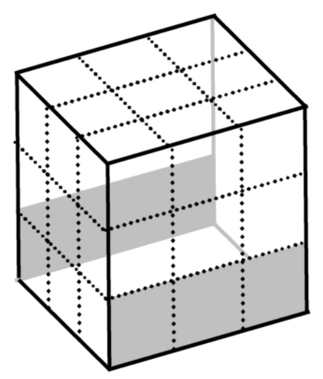
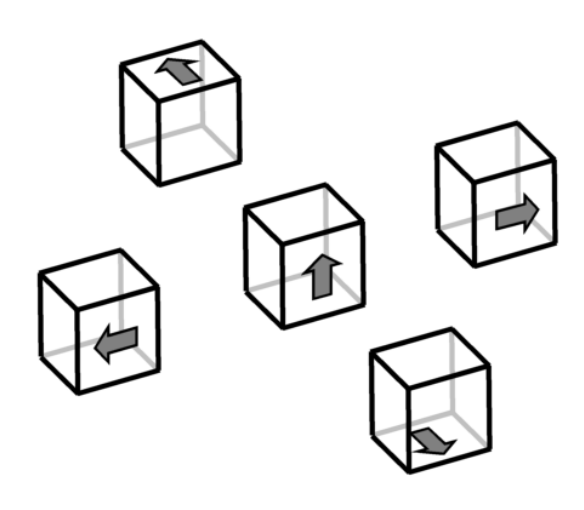
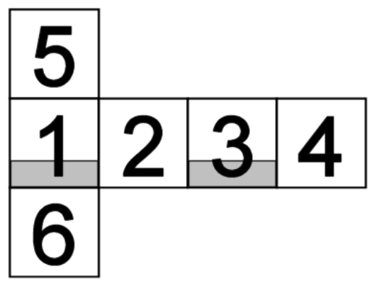

## 문제

You are playing a popular video game which is famous for its depthful story and interesting puzzles. In the game you were locked in a mysterious house alone and there is no way to call for help, so you have to escape on yours own. However, almost every room in the house has some kind of puzzles and you cannot move to neighboring room without solving them.

One of the puzzles you encountered in the house is following. In a room, there was a device which looked just like a dice and laid on a table in the center of the room. Direction was written on the wall. It read:

“This cube is a remote controller and you can manipulate a remote room, Dice Room, by it. The room has also a cubic shape whose surfaces are made up of 3x3 unit squares and some squares have a hole on them large enough for you to go though it. You can rotate this cube so that in the middle of rotation at least one edge always touch the table, that is, to 4 directions. Rotating this cube affects the remote room in the same way and positions of holes on the room change. To get through the room, you should have holes on at least one of lower three squares on the front and back side of the room.”

You can see current positions of holes by a monitor. Before going to Dice Room, you should rotate the cube so that you can go though the room. But you know rotating a room takes some time and you don’t have much time, so you should minimize the number of rotation. How many rotations do you need to make it possible to get though Dice Room?

## 입력

The input consists of several datasets. Each dataset contains 6 tables of 3x3 characters which describe the initial position of holes on each side. Each character is either ‘\*’ or ‘.’. A hole is indicated by ‘\*’. The order which six sides appears in is: front, right, back, left, top, bottom. The order and orientation of them are described by this development view:

  
Figure 4: Dice Room

  
Figure 5: available dice rotations

There is a blank line after each dataset. The end of the input is indicated by a single ‘#’.

## 출력

Print the minimum number of rotations needed in a line for each dataset. You may assume all datasets have a solution.
