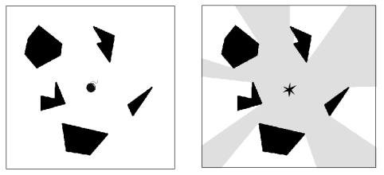

## 문제

Alice and Bob were in love with each other, but they hate each other now.

One day, Alice found a bag. It looks like a bag that Bob had used when they go on a date. Suddenly Alice heard tick-tack sound. Alice intuitively thought that Bob is to kill her with a bomb. Fortunately, the bomb has not exploded yet, and there may be a little time remained to hide behind the buildings.

The appearance of the ACM city can be viewed as an infinite plane and each building forms a polygon. Alice is considered as a point and the bomb blast may reach Alice if the line segment which connects Alice and the bomb does not intersect an interior position of any building. Assume that the speed of bomb blast is infinite; when the bomb explodes, its blast wave will reach anywhere immediately, unless the bomb blast is interrupted by some buildings.

The figure below shows the example of the bomb explosion. Left figure shows the bomb and the buildings(the polygons filled with black). Right figure shows the area(colored with gray) which is under the effect of blast wave after the bomb explosion.

  
Figure 6: The example of the bomb explosion

Note that even if the line segment connecting Alice and the bomb touches a border of a building, bomb blast still can blow off Alice. Since Alice wants to escape early, she wants to minimize the length she runs in order to make herself hidden by the building.

Your task is to write a program which reads the positions of Alice, the bomb and the buildings and calculate the minimum distance required for Alice to run and hide behind the building.

## 입력

The input contains multiple test cases. Each test case has the following format:

```

N 
bx by 
m1 x1,1 y1,1 . . . x1,m1 y1,m1
. 
. 
. 
mN xN,1 yN,1 . . . xN,mN yN,mN
```

The first line of each test case contains an integer N (1 ≤ N ≤ 100), which denotes the number of buildings. In the second line, there are two integers bx and by (−10000 ≤ bx, by ≤ 10000), which means the location of the bomb. Then, N lines follows, indicating the information of the buildings.

The information of building is given as a polygon which consists of points. For each line, it has an integer mi (3 ≤ mi ≤ 100, ΣNi=1 mi ≤ 500) meaning the number of points the polygon has, and then mi pairs of integers xi,j , yi,j follow providing the x and y coordinate of the point.

You can assume that

* the polygon does not have self-intersections.
* any two polygons do not have a common point.
* the set of points is given in the counter-clockwise order.
* the initial positions of Alice and bomb will not by located inside the polygon.
* there are no bomb on the any extended lines of the given polygon’s segment.

Alice is initially located at (0, 0). It is possible that Alice is located at the boundary of a polygon.

N = 0 denotes the end of the input. You may not process this as a test case.

## 출력

For each test case, output one line which consists of the minimum distance required for Alice to run and hide behind the building. An absolute error or relative error in your answer must be less than 10−6 .
