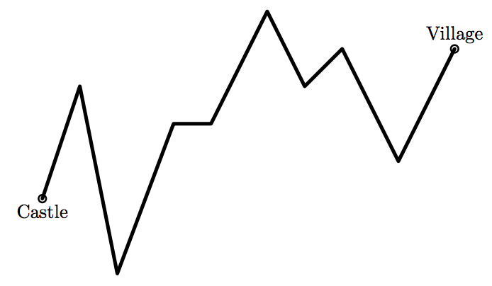

## 문제

Benjamin Forest VIII is a king of a country. One of his best friends Nod lives in a village far from his castle. Nod gets seriously sick and is on the verge of death. Benjamin orders his subordinate Red to bring good medicine for him as soon as possible. However, there is no road from the castle to the village. Therefore, Red needs to climb over mountains and across canyons to reach the village. He has decided to get to the village on the shortest path on a map, that is, he will move on the straight line between the castle and the village. Then his way can be considered as polyline with n points (x1, y1) . . . (xn, yn) as illustlated in the following figure.



Figure 1: An example route from the castle to the village

Here, xi indicates the distance between the castle and the point i, as the crow flies, and yi indicates the height of the point i. The castle is located on the point (x1, y1), and the village is located on the point (xn, yn).

Red can walk in speed vw. Also, since he has a skill to cut a tunnel through a mountain horizontally, he can move inside the mountain in speed vc.

Your job is to write a program to the minimum time to get to the village.

## 입력

The input is a sequence of datasets. Each dataset is given in the following format:

```

vw vc 
x1 y1 
. . . 
xn yn
```

You may assume all the following: n ≤ 1,000, 1 ≤ vw, vc ≤ 10, −10,000 ≤ xi , yi ≤ 10,000, and xi < xj for all i < j.

The input is terminated in case of n = 0. This is not part of any datasets and thus should not be processed.

## 출력

For each dataset, you should print the minimum time required to get to the village in a line. Each minimum time should be given as a decimal with an arbitrary number of fractional digits and with an absolute error of at most 10−6 . No extra space or character is allowed.
