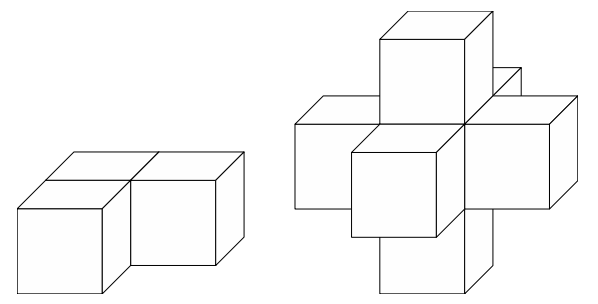
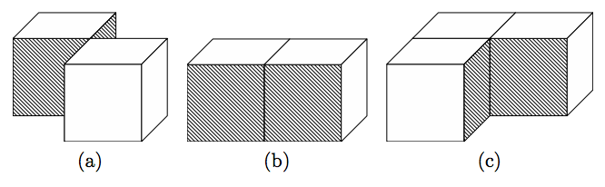
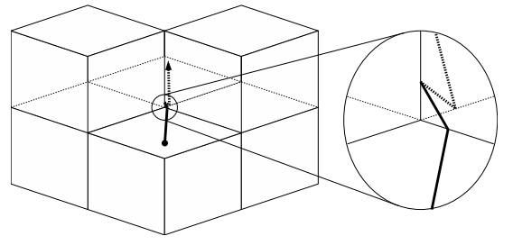

## 문제

It is the year of 2xxx. Human beings have migrated out of the Earth and resided in space colonies. Because of the severe environment of the space, which comes from cosmic rays and meteorites, those colonies have to be continuously repaired by maintenance robots. In this problem, you are requested to write a program that calculates the shortest distance for a robot to move from the present point to the next repair point on a colony.

Each colony can be modeled as a polycube, that is, one or more cubes of the same size all joined by their faces. Note that, as forming a polycube, all cubes of each colony are connected. This implies every cube has at least one face coincident with a face of another cube, except for colonies with a single cube. The figure below illustrates a couple of example colonies.



Figure 2: Example colonies

The maintenance robot can move only on the surface of the polycubes, that is, on faces not in common with other cubes. In addition, due to the structure of the colonies, move of the robot beyond a face is restricted to the following cases: (a) the robot is moving between adjacent faces of the same cube; (b) the robot is moving between adjacent faces of adjacent cubes; and (c) the robot is moving along the inner side of an L-shape, namely, the robot is moving between adjacent faces of two cubes that have the common adjacent cube. Here, adjacent faces denote those with the common edge, and adjacent cubes denote those with the common face.

For the purpose of this problem, we consider an xyz-space (i.e. a three-dimensional space with the Cartesian coordinate system) where all cubes are placed in such a way that each edge is parallel to x-axis, y-axis, or z-axis. Also, the edge length of the cubes is scaled to 100.



Figure 3: Possible moves

## 입력

The input is a sequence of datasets, each of which has the following format:

```

n 
x1 y1 z1 
. . . 
xn yn zn 
sx sy sz dx dy dz
```

n is the number of cubes of a colony (1 ≤ n ≤ 16). (xi , yi , zi) represents the coordinates of the center of the i-th cube, where each coordinate value is guaranteed to be a multiple of 100 (i.e. the edge length of the cubes). (sx , sy, sz ) and (dx , dy, dz ) represent the robot’s present point and the next repair point respectively. You may assume that these two points are always different and that neither of them lies on any edge. All coordinate values are integers between −2000 and 2000 inclusive.

The input is terminated by a line with a single zero, which is not part of any datasets and hence should not be processed.

## 출력

For each dataset, print the distance of the shortest route from the present point to the next repair point. The distance may be printed with any number of digits after the decimal point, provided the absolute error does not exceed 10−8 .

## 힌트

The figure below shows how the robot will move in the sixth case:



Figure 4: The robot’s move in the 6th case
