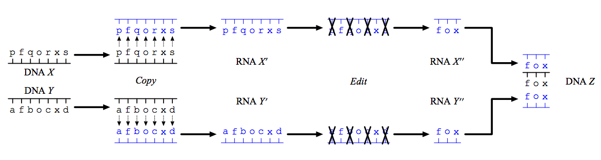

## 문제

Defoxyrenardnucleic Acids (or DNAs for short) and Renardnucleic Acids (or RNAs) are similar organic molecules contained in organisms. Each of those molecules consists of a sequence of 26 kinds of nucleobases. We can represent such sequences as strings by having each lowercase letter from ‘a’ to ‘z’ denote one kind of nucleobase. The only difference between DNAs and RNAs is the way of those nucleobases being bonded.

In the year of 2323, Prof. Fuchs discovered that DNAs including particular substrings act as catalysts, that is, accelerate some chemical reactions. He further discovered that the reactions are accelerated as the DNAs have longer sequences. For example, DNAs including the sequence “fox” act as catalysts that accelerate dissolution of nitrogen oxides (NOx). The DNAs “redfox” and “cutefoxes” are two of the instances, and the latter provides more acceleration than the former. On the other hand, the DNA “foooox” will not be such a catalyst, since it does not include “fox” as a substring.

DNAs can be easily obtained by extraction from some plants such as glory lilies. However, almost all of extracted molecules have different sequences each other, and we can obtain very few molecules that act as catalysts. From this background, many scientists have worked for finding a way to obtain the demanded molecules.

In the year of 2369, Prof. Hu finally discovered the following process:

1. Prepare two DNAs X and Y .
2. Generate RNAs X' and Y' with their sequences copied from the DNAs X and Y respectively.
3. Delete zero or more bases from X' using some chemicals to obtain an RNA X'' .
4. Also delete zero or more bases from Y' to obtain an RNA Y'', which has the same sequence as X'' .
5. Obtain a resulting DNA Z from the two RNAs X'' and Y'' in such a way that Z have the same sequence as X'' and Y'' .

  
Figure 1: New Method for Generation of DNAs

The point is use of RNAs. It is difficult to delete specific bases on DNAs but relatively easy on RNAs. On the other hand, since RNAs are less stable than DNAs, there is no known way to obtain RNAs directly from some organisms. This is why we obtain RNAs from DNAs.

Alice is a researcher in Tail Environmental Natural Catalyst Organization. She is now requested to generate DNAs with particular substrings, applying Hu’s method to some pairs of DNAs. Since longer DNAs are preferred, she wants a means of knowing the longest possible DNAs. So she asked you for help.

Your task is to write a program that outputs the sequence of the longest possible DNA which can be generated from the given pair of DNAs X and Y and contains the given substring C.

## 입력

The input consists of multiple datasets. Each dataset consists of three lines. The first and second lines contain the sequences X and Y respectively. The third line contains the substring C. Each of the sequences and the substrings contains only lowercase letters (‘a’–‘z’) and has the length between 1 and 1600 inclusive.

The input is terminated by a line with “\*”.

## 출력

For each dataset, output the longest sequence in a line. If DNAs with the substring C cannot be obtained in any way, output “Impossible” instead. Any of them is acceptable in case there are two or more longest DNAs possible.
