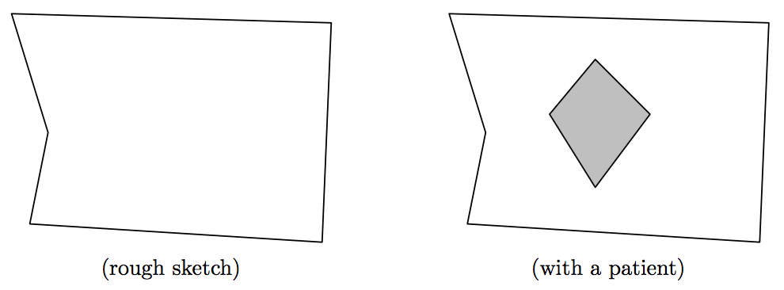

## 문제

HCII, the health committee for interstellar intelligence, aims to take care of the health of every interstellar intelligence.

Staff of HCII uses a special equipment for health checks of patients. This equipment looks like a polygon-shaped room with plenty of instruments. The staff puts a patient into the equipment, then the equipment rotates clockwise to diagnose the patient from various angles. It fits many species without considering the variety of shapes, but not suitable for big patients. Furthermore, even if it fits the patient, it can hit the patient during rotation.

  
Figure 2: The Equipment used by HCII

The interior shape of the equipment is a polygon with M vertices, and the shape of patients is a convex polygon with N vertices. Your job is to calculate how much you can rotate the equipment clockwise without touching the patient, and output the angle in degrees.

## 입력

The input consists of multiple data sets, followed by a line containing “0 0”. Each data set is given as follows:

```

M N 
px1 py1 px2 py2 ... pxM pyM 
qx1 qy1 qx2 qy2 ... qxN qyN 
cx cy
```

The first line contains two integers M and N (3 ≤ M, N ≤ 10). The second line contains 2M integers, where (pxj , pyj) are the coordinates of the j-th vertex of the equipment. The third line contains 2N integers, where (qxj , qyj) are the coordinates of the j-th vertex of the patient. The fourth line contains two integers cx and cy, which indicate the coordinates of the center of rotation.

All the coordinates are between −1000 and 1000, inclusive. The vertices of each polygon are given in counterclockwise order. At the initial state, the patient is inside the equipment, and they don’t intersect each other. You may assume that the equipment doesn’t approach patients closer than 10−6 without hitting patients, and that the equipment gets the patient to stick out by the length greater than 10−6 whenever the equipment keeps its rotation after hitting the patient.

## 출력

For each data set, print the angle in degrees in a line. Each angle should be given as a decimal with an arbitrary number of fractional digits, and with an absolute error of at most 10−7.

If the equipment never hit the patient during the rotation, print 360 as the angle.
