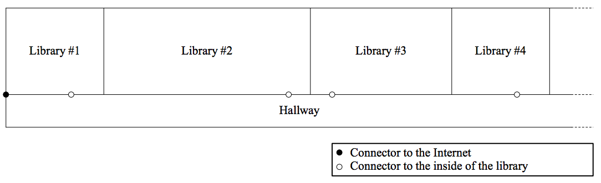
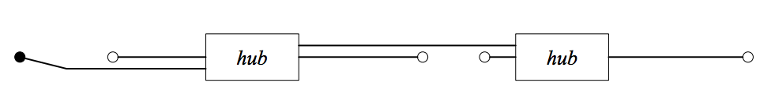

## 문제

Euclid, dwelt in Alexandria, decided to buy and move into a new house as his study was becoming cramped because of too many books he had bought.

His new house had many libraries. His first task was to have all the libraries connected to the Internet. As shown in Figure 3, all the libraries were located along one side of a straight hallway, and each of them had a connector to the inside on the wall (indicated by ◦ in the figure). He had already finished wiring inside each library according to his great idea, so next he was to connect between the libraries and the Internet. The only connector to the Internet was located at the end of the hallway (indicated by • in the figure).

  
Figure 3: The hallway and the libraries

He had brought several Ethernet cables and enough number of hubs with sufficient ports from his old house. Naturally, he wanted to connect all libraries to the Internet with them. In addition, he wanted to lay them straight along the wall, as illustrated in Figure 4, with the following criteria: first to minimize the number of used hubs, and then to make the slack of the cable as less as possible (i.e. to minimize total extra lengths of the cables).

  
Figure 4: Laying cables along the wall

Your mission is to answer the minimum number of hubs and the minimum total extra lengths of the cables for given situations. You may assume that the sizes of hubs and the thicknesses of the cables are both negligible.

## 입력

The input consists of multiple datasets. Each dataset has the following format:

```

N M L 
x1 x2 . . . xN 
l1 l2 . . . lM
```

The first line contains three integers, where N (1 ≤ N ≤ 5) denotes the number of libraries, M (1 ≤ M ≤ 10) denotes the number of cables, and L (1 ≤ L ≤ 20) denotes the length of hallway. The second line contains N positive integers in their increasing order, where the i-th integer indicates the x-coordinate of the connector to the i-th library. The third line contains M positive integers in their increasing order, where the i-th integer indicates the length of the i-th cable. No cable has the length greater than L.

The input is terminated by a line that contains triple zeros. This is not part of any data sets.

## 출력

For each data set, print two integers on a line. The first integer should represent the minimum number of hubs, and the second should represent the minimum total extra lengths of the cables. These two integers should be separated by a single space.

If there is no possible layout, print “Impossible” instead.
